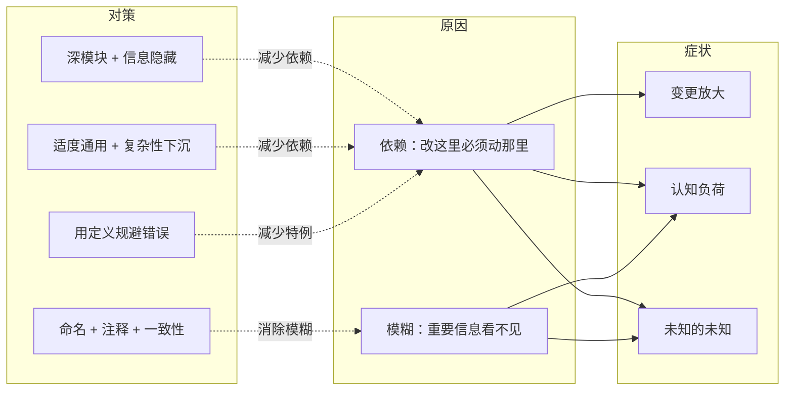

# 软件设计的哲学

> [!abstract] 一句话记住这本书
> **好的设计，就是让人理解和修改代码时，需要知道的东西尽量少。** 能消除的复杂性就消除，消除不了的就关进少数几个模块里，剩下必须知道的，就把它说清楚。

> [!summary] 读完本页你能回答
> - 复杂性到底从哪来？它有哪些症状？
> - 这本书的几条核心原则是什么？各自有什么边界？
> - 看到什么样的"危险信号"时，应该停下来想想设计？

这组笔记讨论怎样设计出**好懂、好用、好改**的软件。九个主题从复杂性的来源讲起，依次讲到模块边界、接口、错误处理、方案比较和代码表达，每篇都配有具体案例和取舍分析。

## 学习路线

第一次读建议按下表顺序走，也可以带着问题直接跳到对应主题。每篇都是独立的，不需要先读其他资料。完整目录见 [[2-Wiki/编程语言/软件设计的哲学/_index|主题目录]]。

| 顺序与主题 | 读完能回答 |
| --- | --- |
| 1. [[复杂性与设计投入]] | 复杂性表现在哪？为什么"能跑"还不够？ |
| 2. [[深模块与抽象]] | 接口的成本是什么？深度为什么不等于代码多？ |
| 3. [[信息隐藏与模块边界]] | 哪些知识该封装在一起？为什么光写 private 不够？ |
| 4. [[通用接口与复杂性下沉]] | 通用到什么程度合适？哪些麻烦该由模块自己扛？ |
| 5. [[分层拆分与合并]] | 什么时候拆开更清楚，什么时候合起来更简单？ |
| 6. [[错误与特殊情况]] | 怎样少写错误处理，又不把关键失败藏起来？ |
| 7. [[设计两次]] | 怎样想出真正不同的方案，并且比出高下？ |
| 8. [[注释命名与可理解性]] | 怎样写清完整的契约，让读者一眼看懂？ |
| 9. [[演进性能与综合应用]] | 怎样把这些原则用到改代码、测试、模式和性能优化上？ |

学完后可以做 [[软件设计复习与自测]] 检验一下。

笔记里的代码都是推演设计用的伪代码，重点在接口、调用过程和责任分配。真用到项目里时，还要根据语言和运行环境，明确字符单位、并发、资源生命周期这些具体约定。

## 1. 先看懂一条因果链

系统变得难改，很少是因为某一次犯了大错，更常见的是**许许多多小依赖和隐含规则慢慢堆起来的**。它们表现为：改一个地方牵动一大片；动手前要先了解一堆背景；甚至不知道还有哪些地方需要考虑。

把这张图串起来读：

- **模块化**让你一次只需要面对一部分复杂性。但模块也会带来接口和协作成本，所以拆得越细不一定越简单。
- **深模块**用一个简单而完整的接口提供很有价值的功能；**信息隐藏**解释了这种"深"是怎么来的：内部的设计决策不再是外部的依赖。
- **通用接口和合理的默认值**让一套机制服务多个场景；**复杂性下沉**让共同的麻烦只处理一次。
- 消除不了的知识，就靠**注释、命名和一致性**说清楚；再用**设计两次、持续重构和测量**，在演进中不断修正边界。

## 2. 几条原则，要成对来记

每条原则都对，但单独记很容易走极端。把它和它的"边界"放在一起记：

| 原则 | 同时记住它的边界 |
| --- | --- |
| 隐藏复杂性 | 调用者**必须**知道的约束，不能省略 |
| 模块应该深 | 把不相干的职责塞进一个类，并不会让它变深 |
| 接口适度通用 | 如果眼下的使用要做大量适配，可能已经通用过头了 |
| 复杂性下沉 | 底层不该因此掌握不属于它的业务策略 |
| 拆分有助于理解 | 新增的接口和跨方法依赖也是成本 |
| 减少异常处理 | 失败还没恢复时，不能假装成功 |
| 先写注释 | 说明必须完整，不能靠删掉约束来显得简洁 |
| 保持一致性 | 不同的概念不应该被强行统一 |
| 持续改善设计 | 在实际约束下，选能验证效果的小步 |

这些是判断方向，不是可以免去思考的规则。看到危险信号后，最好拿**同一个实际任务**去比较几种方案。

## 3. 危险信号速查

| 你观察到 | 进一步检查 | 详见 |
| --- | --- | --- |
| 学会用这个接口，几乎等于学会了它的实现 | 模块是不是没替你藏住多少工作？ | [[深模块与抽象]] |
| 同一个格式或策略在好几个地方写死 | 是不是泄露了共同的知识？ | [[信息隐藏与模块边界]] |
| 按"读取、处理、写入"拆开后，几个部分还是一起改 | 是不是按执行顺序拆，掩盖了知识边界？ | [[信息隐藏与模块边界]] |
| 普通调用也得先学一大堆很少用的选项 | 能不能用默认值，把高级接口分出去？ | [[通用接口与复杂性下沉]] |
| 通用模块不断加入某个业务专用的入口 | 机制里是不是混进了专用策略？ | [[通用接口与复杂性下沉]] |
| 好几层方法传着同样的参数，几乎什么都不做 | 每一层到底增加了什么能力？ | [[分层拆分与合并]] |
| 相似的代码反复出现 | 是缺一个合适的机制，还是控制流不合理？ | [[分层拆分与合并]] |
| 两个方法必须来回跳着看才能懂 | 是不是成了"连体方法"？ | [[分层拆分与合并]] |
| 注释只是把代码翻译了一遍 | 是不是缺了目的、契约和理由？ | [[注释命名与可理解性]] |
| 接口说明里满是私有结构和算法 | 抽象是不是把实现漏给了使用者？ | [[注释命名与可理解性]] |
| 名字很含糊，或者怎么都起不准 | 概念和职责是不是本来就不清楚？ | [[注释命名与可理解性]] |
| 要写一大段说明才知道怎么用 | 是不是前提、状态和特例太多？ | [[注释命名与可理解性]] |
| 快速浏览时很容易猜错 | 哪些关键信息看不见，或者前后不一致？ | [[注释命名与可理解性]] |

"每个调用者都在重复处理同一个错误""没测量就优化"这类具体检查，分别见 [[错误与特殊情况]] 和 [[演进性能与综合应用]]。

## 4. 和重构、设计模式、整洁代码怎么配合

- **[[📚大纲（重构）|重构]]**：用一个个保持行为不变的小步调整结构。可以提炼，也可以内联；选哪个，看整体理解成本和知识边界，而不是哪个手法看起来更高级。
- **[[📚大纲（设计模式）|设计模式]]**：提供成熟方案和共同语言，但也要算上新增的角色、接口和配置的成本。用了某个模式，并不能证明设计就是对的。
- **代码表达**：从命名、函数结构、注释三方面改善。提取函数要检查它是否真的独立；写注释要检查它是否提供了新信息。短函数可能更清楚，但拆过头会让人来回跳；注释能补全契约，但复述代码没有用。可以对照 [[代码整洁之道]] 一起读。

## 5. 学完后，用三个任务检验自己

1. 为同一个需求画出两种接口，写出典型调用，说明哪一方承担了协调的复杂性。可以跟着 [[设计两次]] 里的跨行删除案例练。
2. 找一段你手上的真实代码，指出一个具体的依赖或模糊问题，给出改法和代价，而不只是贴一个"危险信号"标签。
3. 只看接口说明，预测它对空值、边界、失败和状态变化的行为，再去对照实现。如果必须靠写代码的人口头补充，想想缺失的信息应该写在哪里。

## 一分钟回顾

- **复杂性 = 理解和修改的难度**，来源是**依赖**和**模糊**。
- 三个症状：**变更放大、认知负荷、未知的未知**（最后一个最危险）。
- 核心手段：深模块、信息隐藏、适度通用、复杂性下沉、用定义规避错误。
- 消除不了的，就用命名、注释、一致性说清楚。
- 每条原则都有边界；拿同一个真实任务比较方案，比背原则更管用。

## 参考链接

- [A Philosophy of Software Design](https://web.stanford.edu/~ouster/cgi-bin/book.php)
- [软件设计的哲学：中文资料](https://yingang.github.io/aposd2e-zh/)
- [设计原则与危险信号](https://yingang.github.io/aposd2e-zh/summary.html)

## 相关

- [[2-Wiki/编程语言/软件设计的哲学/_index|软件设计的哲学目录]] — 全部主题页面。
- [[软件设计复习与自测]] — 学完后的情境自测。
- [[代码整洁之道]] — 函数、命名、注释的对照阅读。
- [[📚大纲（重构）]] — 结构调整的方法库。
- [[📚大纲（设计模式）]] — 常见设计问题的解决方案。
