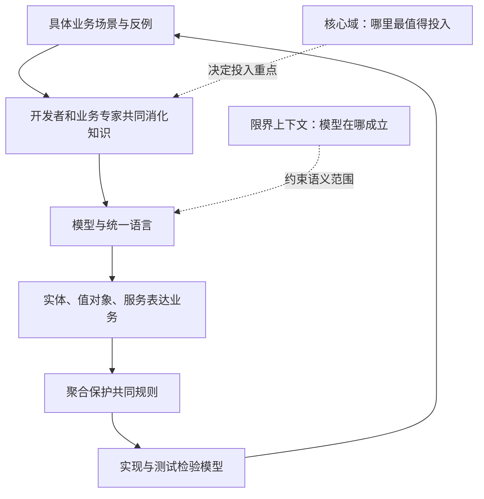

# DDD导读

> [!abstract] 一句话记住 DDD
> **和懂业务的人一起把业务想清楚，提炼成模型，再让讨论、代码和测试都说同一种话。** 理解加深了，就继续改模型；同时讲清楚每套模型在哪个范围内成立。

> [!summary] 读完你能回答
> - DDD 解决的是哪一类"难"？为什么代码写得再整洁也解决不了它？
> - "模型"到底是什么？它和数据库表、类图有什么区别？
> - 什么样的项目值得投入 DDD，什么样的不必？

**对应书籍**：Eric Evans，*Domain-Driven Design: Tackling Complexity in the Heart of Software*（俗称 DDD 蓝皮书）。

## 这组笔记怎么读

适合这样的你：写过类、函数和数据库操作，但没读过 DDD。笔记里的代码都是"职责伪代码"，不绑定任何框架，看懂意思就行。

1. **初读**：本页 → 统一语言 → 实体与值对象 → 聚合 → 完整案例第 1—6 节。
2. **再读**：深化模型 → 限界上下文 → 完整案例第 7—10 节 → 核心域与战略设计。
3. **复习**：先合上笔记做自测，答不上来再顺着题目里的链接回看。

每篇的套路都一样：先讲为什么需要，再讲是什么，然后举例子、说取舍。初读不用硬背模式名称，先把"为什么"弄懂。全部页面见 [[2-Wiki/编程语言/领域驱动设计/_index|学习入口]]。

## 1. 为什么代码很整洁，业务还是难改

### DDD 要对付的是哪种复杂

假设你在做一个订单系统。一开始只有下单、付款、发货，写起来很轻松。后来需求一条条加上来：

- 一个订单可以分两次发货。
- 仓库已经开始拣货了，普通取消要拒绝。
- 已付款但还没交给仓库的订单可以取消，同时要申请退款。
- 预售商品的取消条件又是另一套。

真正的麻烦不是代码变长了，而是**大家嘴里的"取消""发货""完成"根本不是一回事**：客服想的是用户体验，财务关心钱退没退，仓库关心包裹还追不追得回来。

这就是 DDD 的出发点：**把业务理解放在设计的中心。** 概念本身是乱的，你再怎么提炼函数，也只是把混乱分装得更整齐。只有更好的模型，才能解释这些规则为什么各不相同。

| 你遇到的问题 | 主要该找谁帮忙 |
| --- | --- |
| 函数难读、重复很多 | 命名、结构调整、[[2-Wiki/编程语言/代码整洁之道\|代码整洁之道]] |
| 同一个业务词有好几种意思 | 统一语言、限界上下文 |
| 状态判断越来越说不清 | 找出漏掉的概念、深化模型 |
| 好几个对象必须一起守住某条规则 | 聚合与不变量 |
| 全系统每块都投入一样多的设计精力 | 提炼核心域、重新分配精力 |

## 2. 模型不是把现实照抄一遍

先分清两个词：**领域**是软件要服务的那块业务；**领域模型**是为了解决眼前的问题，从中挑出来的概念、关系和规则。

做订单取消时，订单是谁、履约到了哪一步、什么条件能取消，这些很重要；仓库墙刷成什么颜色，通常无关紧要。建模的本事就在于**有目的地做减法**，让关键规则能被讨论、能被实现。

数据库表和类图可以装下模型，但装下了不代表就有了模型。一张只有字段和连线、看不出任何业务规则的类图，往往还没开始解释问题。

> [!tip] 怎么判断模型有没有用
> 拿一条真实需求，用模型里的概念把它讲清楚，再看代码能不能直接写出这条规则。如果两边总要互相"翻译"成完全不同的说法，模型和实现多半已经脱节了。

## 3. 什么时候值得用 DDD

三个条件凑齐时，DDD 最值钱：**业务规则复杂、经常变、团队能长期接触业务专家。** 业务专家不一定有这个头衔，运营、客服、财务，甚至熟悉玩法的策划都算。

如果只是简单的数据录入和查询，不一定需要一堆"丰富的领域对象"。不过就算是简单系统，把词义和边界说清楚也总有好处。一句话：**设计投入跟着业务的复杂度和重要性走。**

## 4. 一张图看懂 DDD 在干什么

注意这是一个**循环**：讨论 → 建模 → 实现 → 验证 → 发现新问题 → 再讨论。实体、值对象这些只是循环里表达模型的工具。图里既没规定类要怎么继承，也没要求你拆成多个服务。

## 5. 回到原书：章节定位

章名和起始页按中文版目录（PDF 第 19—22 页）整理；右边一列是我加的阅读提示，带着问题读效率更高。

| 章节 | 书内起始页 / PDF页 | 带着这个问题读 |
| --- | --- | --- |
| 1：消化知识 | 5 / 27 | 模型是怎么从业务讨论和持续学习里长出来的？ |
| 2：语言的交流和使用 | 16 / 38 | 为什么讨论、文档和代码要用同一套模型语言？ |
| 3：绑定模型和实现 | 29 / 51 | 怎样避免分析模型和代码各走各的？ |
| 4：分离领域 | 43 / 65 | 怎样不让业务逻辑被界面和技术细节淹没？ |
| 5：软件中所表示的模型 | 51 / 73 | 身份、值、服务、关联和模块各自怎么判断？ |
| 6：领域对象的生命周期 | 80 / 102 | 聚合、工厂、仓储怎样保证对象始终合法？ |
| 7：使用语言：一个扩展的示例 | 108 / 130 | 前面这些语言和构件怎么配合工作？ |
| 8：突破 | 131 / 153 | 为什么对业务的新理解会让模型大变样？ |
| 9：将隐式概念转变为显式概念 | 140 / 162 | 怎样从说法、矛盾和别扭的代码里挖出概念？ |
| 10：柔性设计 | 168 / 190 | 什么样的接口和对象更好组合、更好改？ |
| 11：分析模式的应用 | 206 / 228 | 怎样借用成熟的业务模型，又不生搬硬套？ |
| 12：将设计模式应用于模型 | 217 / 239 | 实现层面的模式怎样为业务含义服务？ |
| 13：通过重构得到更深层的理解 | 227 / 249 | 怎样组织探索、落地和持续改进？ |
| 14：保持模型的完整性 | 233 / 255 | 怎样划清上下文边界，处理它们之间的关系？ |
| 15：精炼 | 277 / 299 | 哪些知识是核心，该优先投入？ |
| 16：大比例结构 | 303 / 325 | 什么样的整体秩序能帮人理解，而不是压死局部设计？ |
| 17：领域驱动设计的综合运用 | 336 / 358 | 怎样把上下文、精炼和整体结构结合起来落地？ |

### 小心：这些不是蓝皮书原本的内容

作者 2015 年的《DDD Reference》里说明过，Domain Events、Partnership、Big Ball of Mud 是原书出版之后才加进来的术语和模式。CQRS、事件溯源、微服务、事件风暴、Outbox 也都是后来的相关实践。它们值得学，但别把它们当成蓝皮书本身的主线。

## 一分钟回顾

- DDD 对付的是**业务概念混乱**带来的复杂，不是代码不整洁。
- 模型是**有目的的简化**：只保留解决当前问题需要的概念和规则。
- 判断模型好不好：拿真实需求讲一遍，看代码能不能直接表达。
- 业务复杂、常变、能接触业务专家时最值得投入。
- DDD 是一个"讨论—建模—实现—验证"的循环，不是一套类模板。

## 资料与整理说明

> [!info]- 整理口径与页码约定（深入阅读原书时再看）
> **整理口径**：这是按原书四个部分重新组织的学习笔记。依据 2010 年中文版扫描 PDF 核对了目录、关键模式和代表性案例，并参考了作者公开的模式摘要。笔记只提炼主线，不逐段压缩，也不复述所有原书案例。订单取消案例、伪代码、自测和落地步骤是我补充的教学内容，案例每个阶段都写明了业务假设，不是生产实现；采购订单和银团贷款两段明确标注为"原书案例的简化复述"。
>
> **页码约定**：书内页码指页面顶端的中文页码；PDF 页码指阅读器从封面开始数的页序。本组笔记统一按"PDF 页码 = 书内页码 + 22"换算，已在聚合、突破、柔性设计、限界上下文、核心域和大比例结构几处抽查核对过。页面边缘方框里的英文原版页码不要混进来。

- **主要来源**：《领域驱动设计：软件核心复杂性应对之道》扫描 PDF，共 391 页；Eric Evans 著，赵俐等译，人民邮电出版社，2010 年 11 月第 1 版，ISBN 978-7-115-23887-0。原文件放在下载目录，没有复制进 Vault。
- [Eric Evans 的原书公开目录](https://www.dddcommunity.org/uncategorized/toc/)：用来核对四个部分和 17 章的结构。
- [作者的 DDD 资料页](https://www.domainlanguage.com/ddd/)：蓝皮书及作者提供的学习资源。
- [DDD Reference 作者说明](https://www.domainlanguage.com/ddd/reference/)与[2015 年摘要 PDF](https://www.domainlanguage.com/wp-content/uploads/2016/05/DDD_Reference_2015-03.pdf)：用来核对概念、模式和后续增补的范围。

本文结合中文版关键页面（包括第 7 章书内 108—113 页的建模选择过程）和 *DDD Reference* 模式摘要，做了中文解释、重组和简化，并加入原创教学案例。*DDD Reference* 作者为 Eric Evans，采用 [CC BY 4.0](https://creativecommons.org/licenses/by/4.0/) 授权。采购订单、银团贷款只复述了解释重点所需的部分；没有搬运扫描图片、正文长引文或完整案例。

## 相关

- [[2-Wiki/编程语言/领域驱动设计/_index|学习入口]]
- [[2-Wiki/编程语言/领域驱动设计/统一语言与模型驱动设计|下一篇：统一语言与模型驱动设计]]
- [[2-Wiki/编程语言/领域驱动设计/订单建模完整案例|用完整案例检验理解]]
- [[2-Wiki/编程语言/领域驱动设计/DDD复习与自测|复习与自测]]
