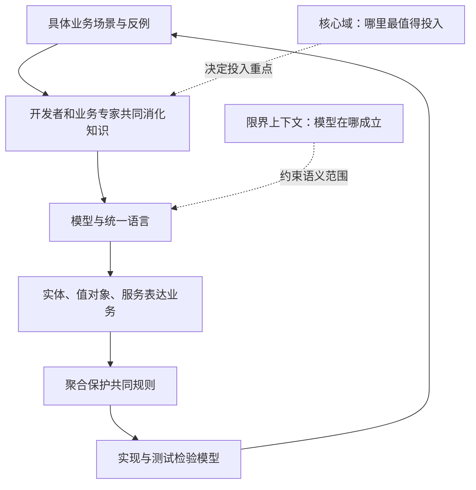

# DDD导读

> [!abstract] 先抓住一句话
> 与业务专家一起，把重要业务知识提炼成模型；让讨论、代码和测试使用这套模型；随着理解加深持续改进它，并明确每套模型在哪个范围内有效。

**对应书籍**：Eric Evans，*Domain-Driven Design: Tackling Complexity in the Heart of Software*（DDD 蓝皮书）。

**整理口径**：这是围绕原书四部分重组的学习笔记。依据你提供的2010年中文版扫描PDF，核对目录、关键模式与代表性案例，并参考作者公开的模式摘要。它提炼全书主线，不逐段压缩，也不复述所有原书案例。订单取消案例、伪代码、自测和落地步骤是本文编写的教学补充；案例逐阶段注明业务假设，不是生产实现；采购订单与银团贷款段落明确标为原书案例的简化复述。

**页码约定**：书内页码指页面顶端的中文页码；PDF页码指阅读器从封面开始计数的页序。本组笔记中的正文定位采用“PDF页码 = 书内页码 + 22”，并已在聚合、突破、柔性设计、限界上下文、核心域和大比例结构处抽核。不要把页面边缘方框中的英文原版页码混进来。

## 阅读路线

> [!summary] 适用读者
> 写过基础的类、函数和数据库操作，但没有读过DDD。先理解业务问题，再用概念做判断；示例是职责伪代码，不依赖某种框架。

本页保留全书导读，具体主题分篇维护。原主笔记文件名保持不变，已有笔记链接仍可从这里进入。

- [[2-Wiki/编程语言/领域驱动设计/DDD蓝皮书读书笔记|DDD导读]] — DDD导读：问题背景、概念全景、学习顺序与原书定位。
- [[2-Wiki/编程语言/领域驱动设计/统一语言与模型驱动设计|统一语言与模型驱动设计]] — 通过业务讨论形成统一语言，让模型与实现相互检验。
- [[2-Wiki/编程语言/领域驱动设计/实体、值对象与领域服务|实体、值对象与领域服务]] — 分层、身份、值、行为归属，以及关联与模块的取舍。
- [[2-Wiki/编程语言/领域驱动设计/聚合、工厂与仓储|聚合、工厂与仓储]] — 以不变量选择聚合边界，理解并发、创建和持久化访问。
- [[2-Wiki/编程语言/领域驱动设计/深化模型与柔性设计|深化模型与柔性设计]] — 从业务反例发现概念，以规格和柔性设计改善模型。
- [[2-Wiki/编程语言/领域驱动设计/限界上下文与上下文映射|限界上下文与上下文映射]] — 明确模型适用范围、团队协作关系与跨界语义翻译。
- [[2-Wiki/编程语言/领域驱动设计/核心域与战略设计|核心域与战略设计]] — 识别核心域，理解精炼与大比例结构的投入取舍。
- [[2-Wiki/编程语言/领域驱动设计/订单建模完整案例|订单建模完整案例]] — 连续推导订单模型：需求、替代方案、边界与协作协议。
- [[2-Wiki/编程语言/领域驱动设计/DDD复习与自测|DDD复习与自测]] — 概念对照、问题导航、十道情境题与折叠答案。

### 怎样读

1. 初读：本页 → 统一语言 → 实体与值对象 → 聚合 → 完整案例第1—6节。
2. 再读：深化模型 → 限界上下文 → 完整案例第7—10节 → 核心域与战略设计。
3. 复习：先独立完成自测，再沿题目链接回看概念；原书页码用于深入阅读。

每篇采用“动机、解释、例子与取舍”的思路；完整案例集中呈现推导过程，进阶补充与答案可折叠。初读不必记住全部模式名称。

## 一、为什么代码很整洁，业务仍然难改

### 1. DDD要处理的是哪种复杂性

假设你开发一个订单系统。最初只有创建、付款和发货，很容易写。后来需求增加：

- 一个订单可以分两次发货。
- 仓库已开始拣货时，普通取消要被拒绝。
- 已付款但未交给仓库的订单可以取消，同时申请退款。
- 预售商品有另一套取消条件。

麻烦不只是代码长，而是大家对“取消”“发货”“完成”理解不同。客服按用户体验理解，财务关心钱是否退回，仓库关心包裹是否可以追回。

**DDD把业务理解作为设计工作的中心。** 如果概念本身混乱，提炼函数只能把混乱分装得更整齐；更好的模型才能解释这些规则为什么不同。

| 问题 | 主要需要什么 |
| --- | --- |
| 函数难读、重复很多 | 命名、结构调整、[[2-Wiki/编程语言/代码整洁之道\|代码整洁之道]] |
| 同一个业务词有几种含义 | 统一语言、限界上下文 |
| 状态条件越来越难解释 | 发现遗漏概念、深化模型 |
| 多个对象必须共同遵守规则 | 聚合与不变量 |
| 全系统都投入同样多的设计成本 | 提炼核心域、分配精力 |

### 2. 模型不是把现实复制一遍

领域是软件服务的业务范围；领域模型是为解决当前问题，选择出来的概念、关系与规则。

做订单取消时，订单身份、履约进度和取消条件很重要；仓库墙壁的颜色通常无关。建模的价值在于**有目的地简化**，让关键规则变得可讨论、可实现。

数据库表、类图可以承载模型，但它们本身不保证模型有业务意义。只有字段和关联、没有业务规则的类图，往往还没有解释问题。

> [!tip] 判断模型有没有用
> 拿一条真实需求，用模型的概念讲清楚它，再看代码能否直接表达这条规则。如果两边总要翻译成完全不同的术语，模型与实现可能已经脱节。

### 3. 什么时候值得投入

业务规则复杂、经常变化，而且团队能持续接触业务专家时，DDD最有价值。业务专家可以是运营、客服、财务，也可以是熟悉玩法的策划。

简单的数据录入和查询，未必需要丰富的领域对象；但澄清词义和边界仍有帮助。设计投入应跟随业务复杂度和重要性。

### 4. 一张图把概念放回主线

实体、值对象等是表达模型的工具；DDD的学习循环还包含讨论、实现、验证和修正。图中没有规定类必须怎样继承，也没有要求拆成多个进程。

## 九、回到原书：章节定位

下表的章名与起始页依据你提供的中文版目录（PDF19—22页）整理。问句是本文编写的阅读提示。

| 章节 | 书内起始页 / PDF页 | 阅读时优先带着的问题 |
| --- | --- | --- |
| 1：消化知识 | 5 / 27 | 模型怎样从业务讨论和持续学习中产生？ |
| 2：语言的交流和使用 | 16 / 38 | 为什么讨论、文档和代码要共用模型语言？ |
| 3：绑定模型和实现 | 29 / 51 | 怎样避免分析模型与代码模型长期脱节？ |
| 4：分离领域 | 43 / 65 | 怎样让业务逻辑免于被界面与技术细节淹没？ |
| 5：软件中所表示的模型 | 51 / 73 | 身份、值、服务、关联和模块各怎么判断？ |
| 6：领域对象的生命周期 | 80 / 102 | 聚合、工厂、仓储怎样保护对象的合法状态？ |
| 7：使用语言：一个扩展的示例 | 108 / 130 | 前面的语言与构件怎样共同工作？ |
| 8：突破 | 131 / 153 | 对业务的新理解为什么可能引发模型大幅变化？ |
| 9：将隐式概念转变为显式概念 | 140 / 162 | 怎样从语言、矛盾和别扭的代码里发现概念？ |
| 10：柔性设计 | 168 / 190 | 什么样的接口与对象让模型更易组合、改进？ |
| 11：分析模式的应用 | 206 / 228 | 怎样借用成熟业务模型而不生搬硬套？ |
| 12：将设计模式应用于模型 | 217 / 239 | 实现模式如何服务领域语义？ |
| 13：通过重构得到更深层的理解 | 227 / 249 | 怎样组织探索、实施和持续改进？ |
| 14：保持模型的完整性 | 233 / 255 | 怎样明确上下文边界并处理它们之间的关系？ |
| 15：精炼 | 277 / 299 | 哪些知识属于核心，应优先投入？ |
| 16：大比例结构 | 303 / 325 | 什么整体秩序能够帮助理解，而不是压住局部设计？ |
| 17：领域驱动设计的综合运用 | 336 / 358 | 怎样把上下文、精炼与整体结构结合实际落地？ |

### 容易混入原书的后续内容

作者2015年的《DDD Reference》注明，Domain Events、Partnership、Big Ball of Mud 是原书之后加入的术语／模式，不能把它们的后续完整讲法当成原书独立模式的原样复述。CQRS、事件溯源、微服务、事件风暴和Outbox也应作为相关后续实践学习，不宜拿来替代蓝皮书本身的主线。

## 十、资料与整理说明

- **主要来源**：你提供的《领域驱动设计：软件核心复杂性应对之道》扫描PDF，共391页；Eric Evans著，赵俐等译，人民邮电出版社，2010年11月第1版，ISBN 978-7-115-23887-0。原文件保留在下载目录，未复制到Vault。
- [Eric Evans 的原书公开目录](https://www.dddcommunity.org/uncategorized/toc/)：用于核对四部分及17章结构。
- [作者的 DDD 资料页](https://www.domainlanguage.com/ddd/)：确认蓝皮书及作者提供的学习资源。
- [DDD Reference 作者说明](https://www.domainlanguage.com/ddd/reference/)与[2015年摘要PDF](https://www.domainlanguage.com/wp-content/uploads/2016/05/DDD_Reference_2015-03.pdf)：用于核对概念、模式与后续增补范围。

本文结合中文版关键页面（包括第7章书内108—113页的建模选择过程）与 *DDD Reference* 模式摘要进行中文解释、重组与简化，并添加原创教学案例。后者作者为 Eric Evans，采用 [CC BY 4.0](https://creativecommons.org/licenses/by/4.0/) 授权。采购订单、银团贷款只复述用于解释重点的部分；未搬运扫描图片、正文长引文或完整案例。

## 相关

- [[2-Wiki/编程语言/领域驱动设计/_index|学习入口]]
- [[2-Wiki/编程语言/领域驱动设计/统一语言与模型驱动设计|下一篇：统一语言与模型驱动设计]]
- [[2-Wiki/编程语言/领域驱动设计/订单建模完整案例|用完整案例检验理解]]
- [[2-Wiki/编程语言/领域驱动设计/DDD复习与自测|复习与自测]]
