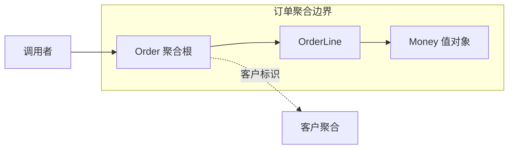

# 聚合、工厂与仓储

> [!summary] 读完你能回答
> - 什么是不变量？聚合边界应该按什么来划？
> - 为什么把方法写进聚合根还不够，还得配上并发控制？
> - "创建一个新对象"和"从数据库找回一个旧对象"有什么本质区别？

**原书对应**：第 6 章。来源、页码约定见 [[2-Wiki/编程语言/领域驱动设计/DDD蓝皮书读书笔记|DDD导读]]。

## 1. 聚合：哪些规则要一起守住

**做法四步走**：先写出必须同时成立的业务规则 → 找出守住这些规则需要哪些对象 → 选一个"根"作为外部修改的唯一入口 → 最后配上持久化和并发控制。

注意顺序。**不要先按数据库外键把对象圈在一起，再回头找规则。**

### 先搞懂"不变量"

Aggregate（聚合）是一组被当作整体来管理的关联对象，包括一个聚合根和一条边界。聚合根负责把守外部修改的入口，并保护边界内的**不变量**。

不变量（原译本叫"固定规则"）就是：**无论怎么改，保存的那一刻必须成立的业务规则。** 改的过程中可以暂时不满足，但事务一提交就必须是对的。它不是普通的"字段之间有关联"。

比如在一个简化的订单模型里：

- 订单行的数量必须是正数。
- 已取消的订单不能再加订单行。
- 订单商品总额必须和当前所有订单行算出来的一致。

这时可以让 `Order` 做根，`OrderLine` 留在边界里。调用者要改数量，就调 `order.changeQuantity(lineId, 3)`，而不是拿到订单行对象随手改字段。



### 有关系，不等于要放进同一个聚合

客户、库存、付款跟订单都有关系，但它们通常有各自独立的生命周期，也经常被不同的人同时修改。不能因为"下单时都要用到"，就把它们全塞进订单聚合。

### 光有聚合根还不够：并发会偷偷破坏规则

聚合根控制入口只是第一步。持久化时还得配上锁或版本检查，否则会出现**两个请求各自都合法，合在一起却违反规则**的情况。

> [!example] 原书采购订单案例（简化复述）
> 批准额度 1000 元，当前总额 700 元。甲、乙同时修改不同的订单行，各加 200 元。两人都在旧状态上检查，都算出 900 元，都觉得没问题。结果一合并，总额变成了 1100 元。
>
> 只锁住各自改的那一行，保护不了"整张订单不超额度"这条规则。得把**整张订单**当作一致性单位，让并发控制覆盖整个边界。（原书 6.1 节，书内 85—86 页／PDF 107—108 页；原图用的是美元，这里只改了单位和叙述。）

> [!warning] 别走极端
> 聚合和事务设计关系很紧密，但别把"一个事务只能改一个聚合"当成蓝皮书在任何场景下的铁律。小聚合、跨聚合的最终一致性等都是后来常见的实践，要结合业务约束来选。分布式流程更不可能靠画一条聚合边界就自动保证一致。

## 2. 工厂和仓储：一个管"生"，一个管"找回"

**为什么需要它们？** 创建过程一复杂，合法性检查就会四处散落；加载过程一复杂，存储细节就会漏得到处都是。工厂和仓储分别把这两种负担封装起来。

**工厂（Factory）**：负责把一个复杂对象或聚合**创建成合法、完整的状态**。

**仓储（Repository）**：为聚合根提供一个"像对象集合一样"的获取和保存入口，把存储细节藏起来。调用者只需要说"把这个订单找回来"，不用自己去拼所有订单行的数据。

```text
订单 = 订单工厂.create(客户标识, 购买项)
订单仓储.add(订单)

已有订单 = 订单仓储.findById(订单标识)
已有订单.requestCancellation()
订单仓储.save(已有订单)
```

**创建和重建是两回事。** 从数据库重建一个已存在的对象时，要恢复它原来的身份和有效状态。这时候不能再触发"创建订单"的副作用，也不该把今天的新建规则生搬到历史数据上。

> [!warning] 别走极端
> - 简单创建直接用构造函数就行，不用给每个类都配一个工厂。
> - 仓储通常围绕聚合根来建，不是每张表、每个值对象都来一个。
> - 报表查询可以用更合适的查询方式，没必要为了展示几列数据去加载整个聚合。

## 3. 这一部分真正要学会的是什么

这些构件提供的其实是**判断工具**：身份重不重要？行为归谁？哪些规则必须一起成立？对象的生命周期怎样始终保持合法？

如果只是把所有名词都做成类，再按模板铺满 Factory 和 Repository，并不会自动得到好模型。

## 一分钟回顾

- **不变量**：保存那一刻必须成立的业务规则。
- **聚合边界按不变量划**，不按外键划；聚合根是唯一的修改入口。
- 有关系不等于同一个聚合：生命周期独立、修改竞争多的对象要分开。
- **聚合根 + 并发控制**才能真正守住规则，缺一不可。
- 工厂管"合法地创建"，仓储管"按聚合根找回和保存"；简单场景不用硬套。

## 相关

- [[2-Wiki/编程语言/领域驱动设计/_index|学习入口]]
- [[2-Wiki/编程语言/领域驱动设计/实体、值对象与领域服务|上一篇：实体、值对象与领域服务]]
- [[2-Wiki/编程语言/领域驱动设计/深化模型与柔性设计|下一篇：深化模型与柔性设计]]
- [[2-Wiki/编程语言/领域驱动设计/订单建模完整案例|用完整案例检验理解]]
- [[2-Wiki/编程语言/领域驱动设计/DDD复习与自测|复习与自测]]
