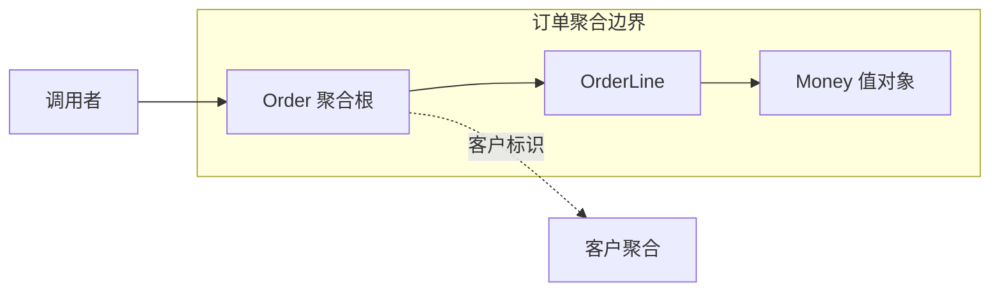

# 聚合、工厂与仓储

> [!summary] 本篇要解决的问题
> 以不变量选择聚合边界，理解并发、创建和持久化访问。

**原书对应**：第6章。来源、页码约定与资料说明见 [[2-Wiki/编程语言/领域驱动设计/DDD蓝皮书读书笔记|DDD导读]]。

## 保护领域对象的生命周期

### 1. 聚合：一起保护哪些规则

> [!summary] 做法
> 先写必须共同成立的业务规则，再找出保护它需要的对象，选定根作为外部修改入口，最后配套持久化和并发控制。不要先按数据库外键把对象圈在一起。

Aggregate 是一组作为整体管理的关联对象，包含聚合根和边界。聚合根负责控制外部修改入口，并保护边界内的不变量。

**不变量是业务要求在合法、可提交的状态中保持成立的条件**，原译本也称“固定规则”。聚合内部操作可能经过暂时的中间状态，但事务完成或修改提交时，相关规则必须满足。它不是普通的字段关联。例如在这个简化订单模型里：

- 订单行数量必须为正。
- 已取消的订单不能再增加订单行。
- 订单商品总额必须由当前订单行正确计算。

可以让 `Order` 成为根、`OrderLine` 留在边界内部。调用者用 `order.changeQuantity(lineId, 3)`，而不是拿到可变订单行随意写字段。



有关系不等于必须放在同一个聚合里。客户、库存、付款通常有独立生命周期和竞争修改，不宜仅因“下单时都要用”就塞进订单聚合。

选择边界时先写出需要一致维护的规则，再讨论对象分组、事务和并发。聚合根控制入口仍不够：持久化实现还要配合锁或版本检查等机制，避免两个请求各自合法、合并后却违反规则。

> [!example] 原书采购订单案例，简化复述
> 批准额度是1000元，当前总额700元。甲、乙同时修改不同的订单行，每人增加200元；各自在旧状态上检查，都得到900元，因此都认为合法。但合并后总额变成1100元。
> 仅锁住各自修改的行没有保护“整张订单不超批准额度”这条规则。需要以订单整体为一致性单位，并让并发控制覆盖这个边界。原书6.1节，书内85—86页／PDF107—108页；原图使用美元，此处只改写单位与叙述。

> [!warning] 一个容易过度简化的口诀
> 聚合与事务设计密切相关，但不要把“每个事务只能修改一个聚合”当成蓝皮书在所有场景下的绝对禁令。小聚合、跨聚合最终一致性等是常见后续实践，需要结合业务约束选择。分布式流程更不可能仅靠画一个聚合边界自动保证一致。

### 2. 工厂和仓储：创建与找回各管一件事

> [!summary] 动机与边界
> 复杂创建过程会分散合法性检查，复杂加载过程会泄漏存储细节。工厂与仓储分别封装这两类负担；简单构造和简单访问无需为了名词而增添接口层。

Factory 负责把复杂对象或聚合创建成合法的完整状态。简单创建可以用构造函数，不必为每个类都新增一个工厂。

Repository 为需要访问的聚合根提供类似对象集合的获取与保存入口，隐藏存储细节。调用者表达“找回这个订单”，而不是亲自拼接所有订单行的数据。

```text
订单 = 订单工厂.create(客户标识, 购买项)
订单仓储.add(订单)

已有订单 = 订单仓储.findById(订单标识)
已有订单.requestCancellation()
订单仓储.save(已有订单)
```

重建已存在对象时，要恢复它的身份和有效状态；不能重新触发“创建订单”的副作用，也不应把所有今天的新建条件机械应用到历史数据。

仓储通常围绕聚合根，而不是为每一张表、每一个值对象各建一个。报表查询可以采用合适的查询方式，不必为了展示几列数据强制加载完整聚合。

### 3. 这一部分真正要学的东西

这些构件提供的是判断工具：**身份是否重要、行为归谁、哪些规则必须共同成立、如何保持对象生命周期合法**。把所有名词做成类，再按模板铺满 Factory 和 Repository，并不自动产生好模型。

## 相关

- [[2-Wiki/编程语言/领域驱动设计/_index|学习入口]]
- [[2-Wiki/编程语言/领域驱动设计/实体、值对象与领域服务|上一篇：实体、值对象与领域服务]]
- [[2-Wiki/编程语言/领域驱动设计/深化模型与柔性设计|下一篇：深化模型与柔性设计]]
- [[2-Wiki/编程语言/领域驱动设计/订单建模完整案例|用完整案例检验理解]]
- [[2-Wiki/编程语言/领域驱动设计/DDD复习与自测|复习与自测]]
