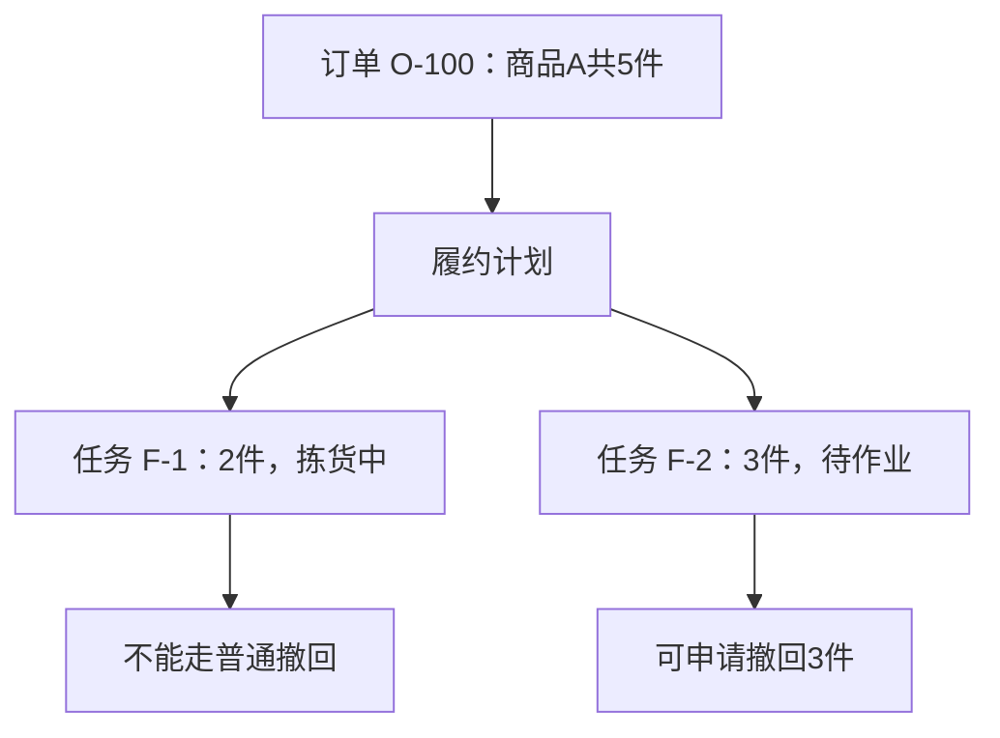
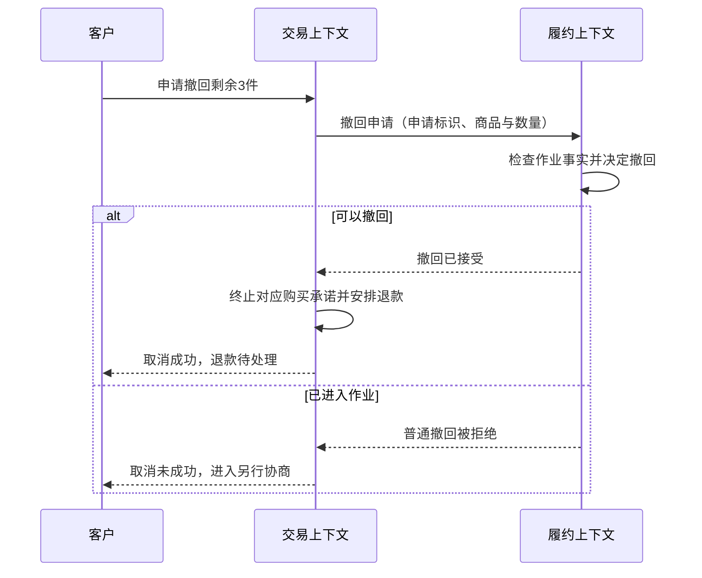

# 订单建模完整案例

> [!summary] 读完你能回答
> - 每一次设计变化背后的业务理由是什么？为什么要封装行为、拆开状态、选这个聚合边界？
> - 什么时候一段过程代码就够了，什么时候该引入新概念？
> - 跨系统协作时，为什么光靠聚合不够，还需要协议？

**原书对应**：原创教学案例，用来串起全书，不是原书案例，也不是第 7 章货运案例的改写。来源、页码约定见 [[2-Wiki/编程语言/领域驱动设计/DDD蓝皮书读书笔记|DDD导读]]。

> [!tip] 怎么读这个案例
> 跟着一个订单系统从小到大长三个阶段。每一步都先问"业务上发生了什么变化"，再看"设计为什么跟着变"。初读看第 1—6 节，再读看第 7—10 节。

## 1. 先把业务问清楚，别急着画类图

客服说："没发货就能取消，付款了要退款。"这句话不能直接当成完整规则。我们先用具体问题把它问清楚：

| 开发者问 | 本例中业务人员的回答 | 对设计的影响 |
| --- | --- | --- |
| 已接单但没出库，算没发货吗？ | 第一阶段还没接仓库系统，人工标记发货前都能取消 | 先做本地规则，不提前设计跨系统协调 |
| 一张订单能只发一部分吗？ | 第一阶段不能，第二阶段才支持 | 第一版用整单状态就够，暂不引入履约计划 |
| 付款后还能取消吗？ | 能，取消成功后另外退款 | 付款状态和购买承诺可能不是一回事 |
| 取消后订单要删掉吗？ | 不删，要能查原因和历史 | 订单有持续的身份，适合做实体 |
| 用户重复点取消怎么办？ | 告诉他已取消，不要重复生成退款任务 | 要定义重复请求返回什么 |

> [!tip] 先学会写场景
> "能取消"太笼统了。写成"订单 O-100 已付款、尚未发货；客户申请整单取消；购买承诺终止，退款进入待处理"，才方便核对模型和结果。

这时候的词表只需要几个词：订单、付款、发货、取消、退款。每个词都写出业务含义。比如"取消"的意思是**购买承诺终止**，既不代表钱已经到账，也不代表历史记录消失。统一语言就是从这里开始起作用的。

## 2. 第一版：一段过程代码也可以是合理的起点

假设只有一个入口，逻辑大概长这样（职责伪代码）：

```text
取消订单(id):
    读取订单
    如果状态是 SHIPPED：拒绝取消
    如果状态是 CANCELLED：返回已取消
    如果状态是 PAID：记下需要退款
    将状态设为 CANCELLED
    保存订单
```

范围很小、只有一个入口时，这样写完全没问题。DDD 并不要求你先搭好一整套框架。

后来事情变了：客服后台也要能取消，开发者把这段逻辑复制了一份；定时任务也会自动关单，第三处干脆只改了状态。问题终于具体起来了：**同一条业务规则有三份实现，只要一处忘了检查发货状态，就会产生非法的状态变化。**

> [!note] 动机要找对
> 此时要解决的问题是"**取消规则由谁统一把关**"。不能只因为函数变长了，就说必须引入聚合或领域服务。

## 3. 把规则放回订单：换一个行为入口

```text
Order.requestCancellation():
    如果已经取消：返回 AlreadyCancelled
    如果已经发货：返回 CannotCancelAfterShipment
    将购买承诺改为取消
    返回 CancellationAccepted
```

应用层加载订单后调用这个方法。前台接口、客服后台、定时任务全都走这同一个入口。持久化的状态字段可能还在，但调用者不能再随手设一个绕过业务检查的状态了。

这一步的设计判断是：**规则需要的事实都在订单里，判断的也是"这个订单能不能变"，所以行为自然属于订单。** 暂时没必要创建一个只会转发调用的 `CancellationDomainService`。

| 改造前 | 改造后 | 实际收益 |
| --- | --- | --- |
| 三个地方各自判断状态 | 三个地方调用同一个业务方法 | 规则要改时，有一个明确的位置 |
| `setStatus(CANCELLED)` | `requestCancellation()` | 代码意图能和业务语言对上 |
| 对象允许任意字段组合 | 对象只暴露合法的行为 | 绕过规则的机会变少 |

这里可以用 [[2-Wiki/编程语言/重构/搬移函数|搬移函数]] 之类的重构手法。但"把方法搬进类"只是实现动作，**判断行为该归谁**才是这一步真正的建模决定。

## 4. 新问题：为什么一个状态字段开始不够用了

客服提了个需求："我想看到订单已经取消了，但退款还在处理中。"旧的枚举只有"待付款、已付款、已发货、已取消"，没法同时表达这两件事。

最直接的办法是加 `CANCELLED_REFUND_PENDING`，再加 `CANCELLED_REFUND_FAILED`……变化少的时候这也能用。但如果资金处理和购买承诺能**各自独立变化**，把它们硬塞进一个枚举，组合状态就会越来越多。

**加字段并不是错误答案。** 我们先把两个维度分开：

| 维度 | 本例的取值 | 回答的问题 |
| --- | --- | --- |
| 购买承诺 | 有效、已取消 | 还需要继续为客户提供这笔购买吗？ |
| 资金处理 | 未付款、已付款、退款中、已退款 | 钱处理到哪一步了？ |

这样，"已取消 + 退款中"就有了明确的含义。不过还得说清楚哪些组合是合法的，比如未付款的订单不可能产生真实退款。**字段拆开了，不代表所有组合都合法。**

> [!warning] 这里还没证明需要两个聚合
> 发现两个业务维度，只说明不该用一个含糊的状态去表示它们。要不要变成独立对象、独立聚合，还得继续看规则、身份、生命周期和一致性需求。先拆字段可能就够了。

## 5. 第二阶段：部分发货让"履约计划"变得必要

业务新增了要求：同一张订单可以从不同仓库分开发货，客户可以取消**还没进入仓库作业**的剩余数量。**注意，这是新增的业务能力，不是第一阶段早就存在的规则。**

举个具体例子：O-100 买了商品 A 共 5 件。任务 F-1 负责发 2 件，已经在拣货了；任务 F-2 负责发 3 件，还没开始作业。客户想取消剩下的 3 件。

先比较几种候选模型：

| 候选模型 | 能表达什么 | 放在当前需求下的问题 |
| --- | --- | --- |
| 订单上加 `isPartiallyShipped` | 是否部分发货 | 不知道是哪些商品、多少数量、哪个任务还能撤回 |
| 订单行加 `shippedQuantity` | 每行已经发了多少 | 还是缺"已经分配但没出库"的作业进度 |
| 表达履约计划和任务分配 | 每个任务负责多少数量、进行到哪一步 | 对象和协作成本变高，但能直接解释分仓和撤回 |

所以选第三种。理由不是"履约计划听起来更专业"，而是**前两种模型回答不了已经确认的业务问题**。



这是一张概念关系图，**还没有划聚合，也没有划部署边界**。图上连着线，不代表这些对象都要放进同一个事务。

假设作业事实仍由一个本地模型掌握，规则可以先这样表达：

```text
履约计划.requestWithdrawal(商品A, 3件):
    检查申请数量大于0
    找到尚未开始作业的有效分配
    检查可撤回数量足够
    将指定数量的分配改为撤回
    返回撤回结果
```

注意：不能简单地用 `已购买 - 已发货` 来算能撤回多少。没发货的那部分，可能已经在拣货了，按当前规则是不能普通撤回的。

> [!summary] 这一步改变了什么
> 旧模型只能问"订单现在是什么状态"，新模型能问"**哪些任务里的哪些数量还能撤回**"。变化来自对业务问题的重新表达。[[2-Wiki/编程语言/重构/提炼类|提炼类]] 能帮你把代码搬过去，但代替不了发现概念的那场讨论。

## 6. 回到一个简单场景，亲手选一次聚合边界

为了把聚合单独讲清楚，这一节只看"编辑订单商品"这个局部问题，不打算用一个边界同时解决付款、履约和退款。

假设业务规定：订单有批准额度，改完商品数量后，总金额不能超过额度。

1. **写出规则**：每行数量为正；总金额不超过额度；已取消的订单不能再改商品。
2. **找出检查需要的信息**：订单状态、批准额度、各订单行的金额和数量。
3. **比较边界**：如果每行独立修改、只检查自己这一行，就保护不了整张订单的额度。
4. **选定根**：订单做根，订单行留在边界内，所有修改都必须经过订单。
5. **定好并发方案**：数据库层对同一张订单的修改，统一做版本检查，或者用等效的锁。

```text
Order.changeQuantity(lineId, newQuantity):
    检查订单仍允许修改
    检查 newQuantity > 0
    计算替换该行数量后的候选总额
    如果候选总额超过额度：拒绝，保持原状态
    应用数量变化
```

为什么先算候选结果、再真正修改？为了**失败时不留下改了一半的状态**。用能可靠回滚的实现也行，但绝不能让调用者拿到一个不合法的内存对象。

> [!example] 并发推演
> 额度 1000，原总额 700。甲和乙都读到了版本 7，各想加 200。
>
> 甲先保存，总额变成 900，版本变成 8；乙再按版本 7 保存，必须失败。乙重新读取到 900 后再判断，发现再加 200 就超额度了，于是被拒绝。
>
> 关键在于：**所有订单行的修改都要纳入同一个并发检查**。如果只是在根类上写了个方法，数据库却允许直接更新订单行，规则照样守不住。

如果业务里没有跨行额度这类共同规则，而且订单行确实需要独立的生命周期和高并发修改，边界就可能不一样。这里要学的是**判断依据**，而不是"订单和订单行在任何系统里都永远是一个聚合"。

## 7. 用应用层把领域行为串成一个完整用例

这一节同样限定场景：**整单取消，而且还没交给履约**。它只用来展示职责怎么分，不涵盖第 5 节的部分撤回。

```text
取消订单用例(订单标识, 调用者):
    检查调用者有权操作这张订单
    开始本地事务
    从订单仓储加载订单及版本
    结果 = 订单.requestCancellation()
    如果结果是 CancellationAccepted：
        保存订单，并校验原版本
        如果已付款，在同一事务中记录唯一的退款待办
    提交事务
    返回业务结果
```

| 代码里的决定 | 谁负责 | 为什么 |
| --- | --- | --- |
| 读取、保存、安排事务 | 应用层协调，基础设施执行 | 属于用例编排和技术实现 |
| 能不能取消、取消改变什么 | 领域对象 | 属于业务规则 |
| 退款待办何时处理、失败后怎么重试 | 应用流程配合基础设施 | 涉及外部副作用和故障恢复 |
| 外部接口说的"成功"到底是什么意思 | 本地模型和接口翻译一起明确 | 涉及语义，不能只看 HTTP 状态码 |

权限也要看具体含义：验证登录凭证是技术和应用层关心的事；但"只有投保人才能退保"这种资格规则，可能本身就是领域规则。别一看到"权限"两个字，就机械地把它踢出领域层。

> [!note]- 进阶补充：为什么退款不能直接写在数据库事务里
> 本地数据库事务回滚不了外部支付系统。所以教学例子的做法是：先可靠地记下一条"退款待办"，再去调用外部接口。还需要一个业务操作标识防止重复退款，并且能查询或核对最终结果。
>
> 事务消息、Outbox、可靠任务表都是可选的工程方案，不是蓝皮书规定的固定结构。本笔记的伪代码也不是生产级的支付实现。

## 8. 第三阶段：仓库独立之后，问题换了一种问法

现在仓库系统独立运行，拣货的事实由它说了算。交易端刚读到"还没拣货"，仓库下一秒就可能开始拣货。所以"先查仓库、再本地取消"这种做法存在竞争。

本例新定了一个协议：**交易端提出撤回申请；履约端按自己的规则和并发控制决定接受还是拒绝；交易端收到确认后，再终止对应的购买承诺并安排退款。** 这是本例的选择，需要业务认可。有些业务也可能选择"先接受取消，再赔偿"，但两种做法不能混着用。



箭头表示业务上的交互顺序，不规定是 HTTP 还是消息队列。真实实现还要处理超时、重复和迟到的结果：用申请标识把同一次操作关联起来；重复的确认不能导致重复退款；结果不确定时先保持"待确认"，再重试查询或对账。

这时你会发现，"完成"在三个地方意思都不一样：交易关心购买承诺结束了没有，履约关心作业做完了没有，财务关心钱处理完了没有。每个地方可以有自己的模型，彼此通过明确的协议沟通。**这就是限界上下文在这个例子里的意义。**

## 9. 用场景验证每一步，而不是数有几个类

| 场景 | 应该得到的结果 | 检验的是哪个设计 |
| --- | --- | --- |
| 未付款、未发货，整单取消 | 取消成功，不产生退款 | 行为封装和资金维度 |
| 已付款整单取消，退款还没完成 | 购买承诺已取消，资金仍在处理 | 独立表达两种业务事实 |
| 5 件里 2 件在拣货、3 件待作业 | 只能对符合条件的 3 件申请撤回 | 履约任务和数量模型 |
| 两人各加 200，原 700、额度 1000 | 不能两个都成功、最后变成 1100 | 聚合和并发控制 |
| 已经接受的取消又被请求一次 | 返回原来的结果，不重复安排退款 | 重复请求的语义 |
| 仓库刚开始拣货，撤回申请也到了 | 由履约端给出受保护的决定 | 上下文协议和决定权 |
| 退款调用超时 | 不把超时当成失败，也不当成成功 | 结果核对和恢复机制 |

这些是验收场景，**还不是已经跑起来的自动化测试**。真正实现时，要把它们变成可执行的检查，并补齐具体系统里的各种错误路径。

## 10. 把这套方法用到你自己的需求上

> [!summary] 七步走
> 1. 写一个具体场景，以及它的预期结果。
> 2. 把含糊的词改写成业务人员能确认的说法。
> 3. 先用最少的概念表达规则，记下业务假设。
> 4. 用反例找出旧模型解释不了的事实。
> 5. 至少比较两种模型：各自能回答什么，又增加了什么成本。
> 6. 用身份、行为归属和不变量来选对象、划边界。
> 7. 最后再处理事务、存储和跨系统协议，然后回到原场景检查一遍。

模型演进其实包含两种不同的工作：**业务没变**，只是调整表达和结构；**业务真的变了**，需要修改行为。前者要守住已有行为，后者要重新确认验收规则。别把两者都含糊地叫作"重构"。

## 一分钟回顾

- 第一版用过程代码完全可以；**规则开始被复制时**，才是把行为放回对象的时机。
- 一个状态字段装不下时，先找出**独立变化的业务维度**，再决定拆字段还是拆对象。
- 引入新概念（履约计划）的理由是：**旧模型回答不了已确认的业务问题**。
- 聚合边界按不变量选，并且必须配上覆盖整个边界的并发控制。
- 跨系统后，"谁说了算"要靠**协议**定；同一个"完成"在不同上下文里含义不同。

## 相关

- [[2-Wiki/编程语言/领域驱动设计/_index|学习入口]]
- [[2-Wiki/编程语言/领域驱动设计/核心域与战略设计|上一篇：核心域与战略设计]]
- [[2-Wiki/编程语言/领域驱动设计/DDD复习与自测|下一篇：DDD复习与自测]]
