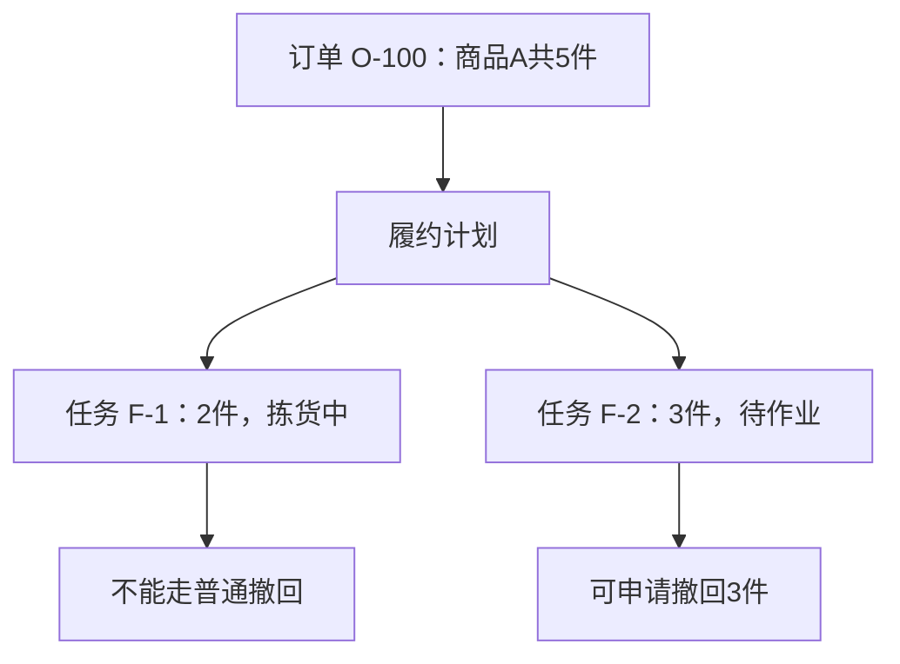
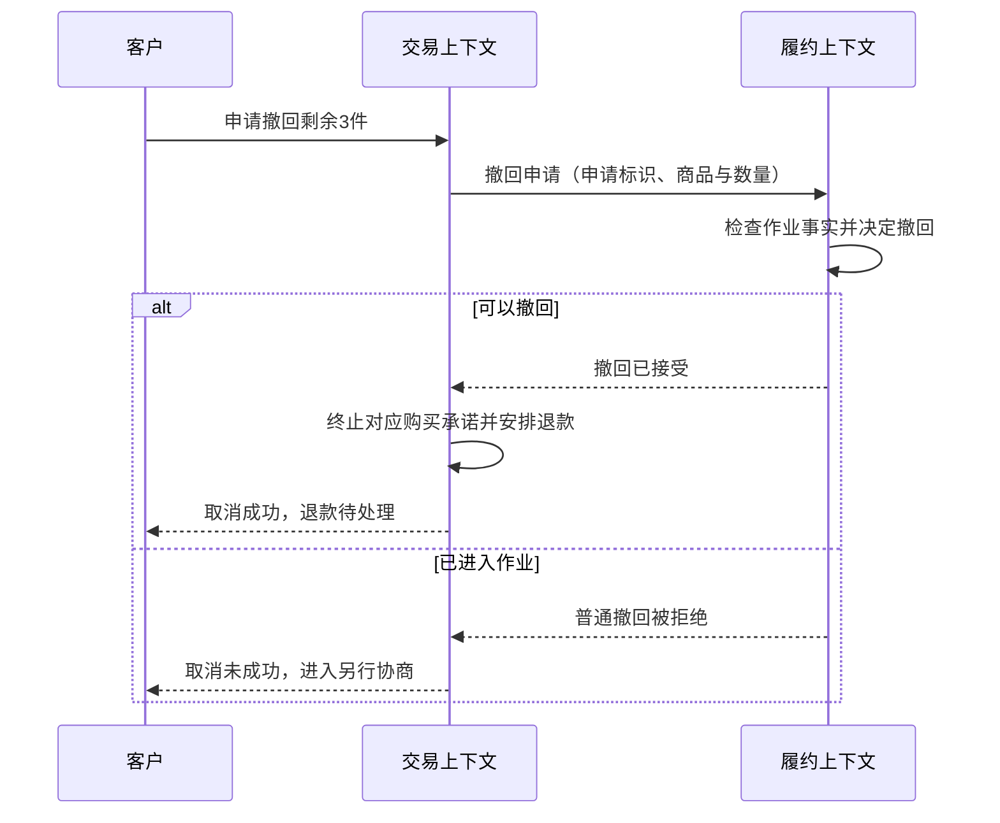

# 订单建模完整案例

> [!summary] 本篇要解决的问题
> 连续推导订单模型：需求、替代方案、边界与协作协议。

**原书对应**：原创教学案例；用于综合理解全书，不是原书案例。来源、页码约定与资料说明见 [[2-Wiki/编程语言/领域驱动设计/DDD蓝皮书读书笔记|DDD导读]]。

## 七、完整案例：从取消订单到发现模型

> [!summary] 学习目标
> 看完后，你应能解释每次设计变化的业务依据：为什么封装行为、为什么拆开状态、为什么选择聚合边界、为什么跨系统时还需要协议。以下订单故事是原创教学例子，不是原书第7章货运案例的改写。

### 1. 先约定业务，不急着画类图

客服说：“没发货就能取消，付款了要退款。”开发者不能直接把这句话当作完整规则。我们先用具体问题补足含义。

| 开发者的问题 | 本例业务人员确认的答案 | 对设计的影响 |
| --- | --- | --- |
| 已接单但没出库算没发货吗？ | 第一阶段还没有仓库集成，人工标记发货前都能取消 | 先做本地规则，不预先设计跨系统协调 |
| 一张订单能只发一部分吗？ | 第一阶段不能，第二阶段才支持 | 第一版允许整单状态，暂不引入履约计划 |
| 付款以后还能取消吗？ | 能；取消成功后另行退款 | 付款状态与购买承诺可能不是同一维度 |
| 取消后订单要删掉吗？ | 不删，需要查询原因与历史 | 订单有持续身份，适合实体 |
| 重复点取消怎么办？ | 告知已取消，不重复生成退款任务 | 需要定义重复请求的结果 |

> [!tip] 先学会写场景
> “能取消”太宽泛。写成“订单O-100已付款、尚未发货；客户申请整单取消；购买承诺终止，退款进入待处理”，才容易核对模型和结果。

这一阶段的词表只需几个词：订单、付款、发货、取消、退款。每个词都写出业务含义。例如“取消”表示购买承诺终止，不代表钱已到账，也不代表历史记录消失。这就是统一语言开始发挥作用的地方。

### 2. 第一版：一段过程代码也可以是合理起点

假设只有一个入口，逻辑可能是这样的职责伪代码：

```text
取消订单(id):
    读取订单
    如果状态是 SHIPPED：拒绝取消
    如果状态是 CANCELLED：返回已取消
    如果状态是 PAID：记下需要退款
    将状态设为 CANCELLED
    保存订单
```

在范围很小、入口唯一时，它未必需要复杂改造。DDD不要求先建好一整套框架。

后来客服后台也能取消，开发者复制了这段逻辑；定时任务也会关单，第三处只改了状态。问题开始具体化：同一条业务规则有三份实现，一处忘记检查发货状态，就会产生非法变化。

> [!summary] 动机
> 当前要解决的是“取消规则由谁统一保护”。不能仅因函数变长就宣称必须引入聚合或领域服务。

### 3. 把规则放回订单：改变行为入口

```text
Order.requestCancellation():
    如果已经取消：返回 AlreadyCancelled
    如果已经发货：返回 CannotCancelAfterShipment
    将购买承诺改为取消
    返回 CancellationAccepted
```

应用层加载订单后调用这个方法，接口、客服后台和定时任务都使用同一个入口。持久化字段仍然可能存在，但调用者不能随意设置一个跳过业务检查的状态。

这一步的设计判断是：规则所需事实在订单内，判断的是这个订单能否改变，因此行为自然归属订单。暂时没有必要创建一个只转发调用的 `CancellationDomainService`。

| 改造前 | 改造后 | 实际收益 |
| --- | --- | --- |
| 三处自己判断状态 | 三处调用同一业务方法 | 规则修改有明确位置 |
| `setStatus(CANCELLED)` | `requestCancellation()` | 调用意图能和业务语言对照 |
| 对象允许任意字段组合 | 对象暴露合法行为 | 降低绕过规则的机会 |

这里可以使用 [[2-Wiki/编程语言/重构/搬移函数|搬移函数]] 等重构手法，但方法搬进类只是实现动作；判断行为归属才是本例的建模决定。

### 4. 新问题：一个状态为什么开始不够用

客服提出：“我想看到订单已经取消，但退款还在处理中。”旧枚举只有待付款、已付款、已发货、已取消，无法同时表达这个事实。

可以增加 `CANCELLED_REFUND_PENDING`，再增加 `CANCELLED_REFUND_FAILED`。这在变化很少时也能工作，但如果资金处理与购买承诺能独立变化，把它们组合成一个枚举，会不断产生组合状态。

**增加字段并非错误答案。** 我们先分开两个维度：

| 维度 | 本例状态 | 回答的问题 |
| --- | --- | --- |
| 购买承诺 | 有效、已取消 | 还需要向客户提供这笔购买吗？ |
| 资金处理 | 未付款、已付款、退款中、已退款 | 钱处理到了哪一步？ |

这样，“已取消＋退款中”就有明确含义。还必须说明合法组合，例如未付款订单不能产生实际退款；拆开字段并不意味着所有组合都合法。

> [!warning] 这里尚未证明必须新增两个聚合
> 发现两个业务维度，只说明不宜用一个含混状态表示它们。是否变成独立对象、独立聚合，要继续看规则、身份、生命周期和一致性需求。先拆字段可能足够。

### 5. 第二阶段：部分发货让履约计划变得有必要

现在业务新增要求：同一张订单可以分仓发货，客户可以取消尚未进入仓库作业的剩余数量。**这是新增业务能力；不能把它说成第一阶段早已存在的规则。**

例如O-100购买商品A共5件：任务F-1准备发2件，已经进入拣货；任务F-2准备发3件，尚未开始作业。客户要取消剩余3件。

| 候选模型 | 能表达什么 | 当前需求下的问题 |
| --- | --- | --- |
| 订单上增加 `isPartiallyShipped` | 是否部分发货 | 不知道哪些商品、哪些数量、哪个任务可撤回 |
| 订单行增加 `shippedQuantity` | 每行已发多少 | 仍缺少已分配但尚未出库的作业进度 |
| 表达履约计划和任务分配 | 每个任务负责的数量及进度 | 增加对象与协作成本，但能直接解释分仓和撤回 |

因此我们采用第三种方案。选择依据不是“履约计划听起来专业”，而是前两种模型回答不了已确认的问题。



这是概念关系图，**还没有划定聚合或部署边界**。图上有连线，不代表全部对象应放进同一事务。

在仍由一个本地模型掌握作业事实的假设下，可以先表达这样的规则：

```text
履约计划.requestWithdrawal(商品A, 3件):
    检查申请数量大于0
    找到尚未开始作业的有效分配
    检查可撤回数量足够
    将指定数量的分配改为撤回
    返回撤回结果
```

注意：不能只计算 `已购买 - 已发货`。尚未发货的部分可能已经进入拣货，按当前业务规则不能普通撤回。

> [!summary] 效果
> 旧模型问“订单现在是什么状态”，新模型能问“哪些任务中的哪些数量还可以撤回”。变化来自对业务问题的重新表达。[[2-Wiki/编程语言/重构/提炼类|提炼类]] 能完成代码搬迁，但不能替代发现概念的讨论。

### 6. 回到简单范围，亲手选择一个聚合边界

为了单独理解聚合，本节回到订单商品编辑这个局部问题，不试图用一个边界同时解决付款、履约和退款。

假设业务规定：订单有批准额度，修改商品数量后，总金额不得超过额度。

1. 写出规则：各行数量为正；总金额不超过额度；已取消订单不许再改商品。
2. 找出检查需要的信息：订单状态、批准额度、各订单行的金额与数量。
3. 比较边界：如果每行独立修改，只检查本行，无法保护整体额度。
4. 选择订单为根，订单行在边界内；修改必须经过订单。
5. 明确并发方案：数据库实现对同一订单的修改采用统一版本检查或等效的锁定策略。

```text
Order.changeQuantity(lineId, newQuantity):
    检查订单仍允许修改
    检查 newQuantity > 0
    计算替换该行数量后的候选总额
    如果候选总额超过额度：拒绝，保持原状态
    应用数量变化
```

为什么先算候选结果再修改？为了让失败不留下半改状态。也可以采用能可靠回滚的实现，但不能让调用者拿到不合法的内存对象。

> [!example] 并发推演
> 额度1000，原总额700。甲和乙都读到版本7，各想增加200。
> 甲保存900并将版本变为8；乙再按版本7保存时必须失败。乙重新读取900后再判断，发现加200会超额度，因此拒绝。
> 关键在于所有订单行修改都纳入同一并发检查。仅在根类上写一个方法，而数据库允许直接更新订单行，仍不能保证规则。

如果没有跨行额度等共同规则，而且订单行确实需要独立生命周期与高并发修改，边界可能不同。这里学习的是判断依据，不是“订单和行在任何系统里永远是一个聚合”。

### 7. 用应用层把领域行为连成一次用例

以下再次限定为**整单、尚未交接履约的取消**。这是用于展示职责的局部用例，不覆盖第五节的部分撤回。

```text
取消订单用例(订单标识, 调用者):
    检查调用者有权操作这张订单
    开始本地事务
    从订单仓储加载订单及版本
    结果 = 订单.requestCancellation()
    如果结果是 CancellationAccepted：
        保存订单，并校验原版本
        如果已付款，在同一事务中记录唯一的退款待办
    提交事务
    返回业务结果
```

| 代码中的决定 | 谁负责 | 为什么 |
| --- | --- | --- |
| 读取、保存、安排事务 | 应用层协调，基础设施执行 | 属于用例编排和技术实现 |
| 是否允许取消、取消改变什么 | 领域对象 | 属于业务规则 |
| 退款待办何时处理、失败后怎样重试 | 应用流程配合基础设施 | 涉及外部副作用与恢复 |
| 外部接口的“成功”到底是什么 | 本地模型和接口翻译共同明确 | 涉及语义，不能只看HTTP状态码 |

权限也要按具体含义判断：登录凭证验证是技术与应用关注；“只有投保人可退保”之类的资格规则，可能本身就是领域规则。不要机械地将所有含“权限”的判断排除在领域外。

> [!note]- 进阶补充：为什么退款不能直接写在数据库事务中
> 普通本地数据库事务不能自动回滚外部支付系统。教学例子选择先可靠记录退款待办，再执行外部调用。需要业务操作标识防止重复退款，并能查询或核对最终结果。
> 事务消息、Outbox、可靠任务表是可能的工程方案，不是蓝皮书要求的固定结构。本笔记的伪代码不构成生产级支付实现。

### 8. 第三阶段：仓库独立以后，边界改变了问题

现在仓库独立运行并拥有拣货事实。交易端读取“未拣货”后，仓库可能立即开始拣货。因此，“先查仓库，再本地取消”存在竞争。

本例新增协议：**交易端提出撤回申请；履约端在自己的规则与并发控制下接受或拒绝；交易端收到确认后，再终止相应购买承诺并安排退款。** 这是本例选择，需要业务认可；某些业务也可能允许先接受取消再赔偿，不能混用。



箭头表达业务交互顺序，不规定HTTP或消息队列。真实实现还要处理超时、重复和迟到结果：用申请标识关联同一操作；重复确认不能重复退款；不确定结果先保留待确认状态，再重试查询或对账。

这时“完成”在三处不同：交易关注购买承诺结束，履约关注作业结束，财务关注资金处理完成。每处可以有自己的模型，通过明确协议交流。这就是限界上下文在例子里的意义。

### 9. 用场景验证每一步，而不是数类的数量

| 场景 | 应有结果 | 检查的设计 |
| --- | --- | --- |
| 未付款、未发货整单取消 | 取消成功，不产生退款 | 行为封装与资金维度 |
| 已付款整单取消，退款尚未完成 | 购买承诺已取消，资金仍在处理中 | 独立表达业务事实 |
| 5件中2件拣货、3件待作业 | 只能对符合条件的3件申请撤回 | 履约任务与数量模型 |
| 两人各加200，原700、额度1000 | 不能都成功后得到1100 | 聚合与并发控制 |
| 已接受的取消再次请求 | 返回既有结果，不重复安排退款 | 重复请求语义 |
| 仓库刚开始拣货，撤回也到达 | 履约端给出受保护的决定 | 上下文协议与决定权 |
| 退款调用超时 | 不把超时等同于失败或成功 | 结果核对与恢复机制 |

这些是验收场景，**并非已经运行的自动化测试**。实现时应把它们变成可执行检查，并补齐具体系统的错误路径。

### 10. 从案例迁移到自己的需求

> [!summary] 做法
> 1. 写一个具体场景和它的预期结果。
> 2. 把含混的词改写成业务人员能够确认的说法。
> 3. 先用最少概念表达规则，记录业务假设。
> 4. 用反例暴露旧模型解释不了的事实。
> 5. 比较至少两种模型：各能回答什么，增加什么成本。
> 6. 用身份、行为归属和不变量选择对象与边界。
> 7. 再处理事务、存储、跨系统协议，并回到原场景检查。

模型演进可能包含两种工作：业务不变时调整表达与结构；业务真的改变时修改行为。前者需要守住已有行为，后者需要重新确认验收规则。二者不能都含糊地叫“重构”。

## 相关

- [[2-Wiki/编程语言/领域驱动设计/_index|学习入口]]
- [[2-Wiki/编程语言/领域驱动设计/核心域与战略设计|上一篇：核心域与战略设计]]
- [[2-Wiki/编程语言/领域驱动设计/DDD复习与自测|下一篇：DDD复习与自测]]
