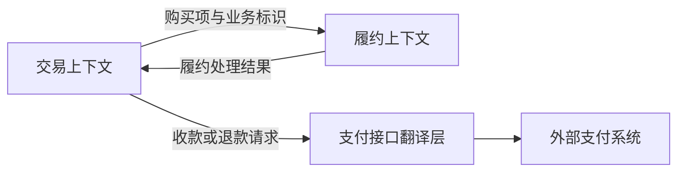

# 限界上下文与上下文映射

> [!summary] 本篇要解决的问题
> 明确模型适用范围、团队协作关系与跨界语义翻译。

**原书对应**：第14章。来源、页码约定与资料说明见 [[2-Wiki/编程语言/领域驱动设计/DDD蓝皮书读书笔记|DDD导读]]。

## 五、让多套模型共同工作

### 1. 限界上下文：这套模型在哪个范围内成立

> [!summary] 做法
> 先检查实际存在的语言和模型差异，明确每个模型的适用范围、维护者与集成点，再决定跨界如何解释信息。不是先按订单、客户等名词一词拆一个服务。

Bounded Context（限界上下文）明确一套模型及其语言的适用边界。边界可以体现在团队协作、代码组织、业务范围与集成方式中。

假设系统中有三个上下文：

| 上下文 | 它主要关心的概念与问题 |
| --- | --- |
| 交易 | 订单表达用户的购买承诺，能否付款或取消 |
| 履约 | 履约任务表达待处理的商品数量，能否拣货和出库 |
| 财务 | 收款、退款等记录表达资金事实，如何核对 |

它们可以共享业务标识进行关联，却不必共享同一个巨大 `Order` 类。各自只接收需要的信息，并按自己的业务规则解释。

**上下文、聚合和模块回答不同问题**：上下文界定模型语义范围，聚合界定对象的一致性边界，模块组织内聚的概念。一套上下文可以包含多个模块和聚合。

上下文也不等于进程或微服务。单体程序可以包含几套上下文，部署拆分则还需考虑运维、性能、可靠性和团队成本。

原书专门区分 Bounded Context 与 Module：模块可以组织同一模型中的元素；上下文则明确模型的适用范围。单独分包，并不自动解决语义冲突。（书内236—237页／PDF258—259页。）

### 2. 持续集成：让同一范围内的模型保持一致

原书的 Continuous Integration 不仅涉及频繁集成代码和自动测试，也包括不断统一语言与模型。几个人在同一个上下文里分别写出互相冲突的“订单”，即使构建通过，模型也已经分裂。

团队需要通过沟通、测试和持续集成，尽早暴露这种分歧。

### 3. 上下文映射：画出现实的边界和关系

Context Map 不只是理想架构图。它记录实际存在的模型边界、协作关系，以及跨边界时需要怎样翻译。

这张图的箭头表示教学例子中的信息流，不表示上下游权力关系，也不规定同步调用或消息机制。实际映射还应写出：谁制定接口、谁能要求变更、哪一侧承担翻译成本。

### 4. 原书的上下文关系，怎么选

| 关系或模式 | 可以怎样理解 | 主要代价 |
| --- | --- | --- |
| Shared Kernel，共享内核 | 两个团队共同维护一小块共享模型与实现 | 共享部分的修改需要协调和联合验证 |
| Customer/Supplier，客户／供应商开发 | 下游需求能影响上游计划与交付 | 需要真实的协商和履约关系 |
| Conformist，遵奉者 | 无法影响上游，选择采用它的模型 | 本地模型会受到上游限制 |
| Anticorruption Layer，防腐层 | 翻译外部模型，保护本地模型 | 需要维护转换及语义差异 |
| Separate Ways，各行其道 | 集成收益不足，各自解决问题 | 可能重复实现或保留人工流程 |
| Open Host Service，开放主机服务 | 提供稳定、统一的服务协议给多个调用方 | 接口演进与兼容性成本 |
| Published Language，发布语言 | 用明确约定的交换语言传递含义 | 需维护语义、格式和版本约定 |

开放主机服务偏向“如何提供可用接口”，发布语言偏向“通过接口交换什么含义”，两者可以搭配。

这些模式并非全部互斥。不要只看团队名称或调用方向来选关系，要看双方实际的控制权和合作意愿。

### 5. 防腐层为什么不只是字段改名

外部支付接口可能返回 `SUCCESS`。本地要明确：它表示退款请求被接受，还是钱已经退到账户？两者不能被翻译成同一个“退款完成”。

防腐层需要处理这种语义差异，而不只是把 `pay_id` 改成 `paymentId`。必要时，本地模型要保留“申请已受理、结果待确认”的中间事实。

> [!tip] 跨边界设计先写两列
> 左边写外部词语及其确切含义，右边写本地词语及其确切含义。遇到无法一一对应的地方，就是需要建模和制定协议的地方。

## 相关

- [[2-Wiki/编程语言/领域驱动设计/_index|学习入口]]
- [[2-Wiki/编程语言/领域驱动设计/深化模型与柔性设计|上一篇：深化模型与柔性设计]]
- [[2-Wiki/编程语言/领域驱动设计/核心域与战略设计|下一篇：核心域与战略设计]]
- [[2-Wiki/编程语言/领域驱动设计/订单建模完整案例|用完整案例检验理解]]
- [[2-Wiki/编程语言/领域驱动设计/DDD复习与自测|复习与自测]]
