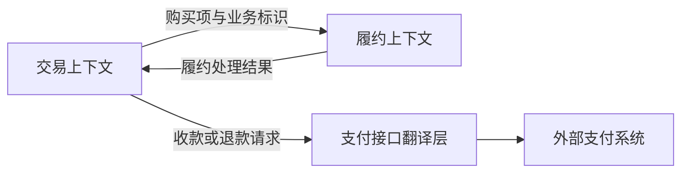

# 限界上下文与上下文映射

> [!summary] 读完你能回答
> - 同一个词在两个团队嘴里意思不一样，该统一还是该分开？
> - 限界上下文、聚合、模块、微服务分别回答什么问题？
> - 跟外部系统对接时，防腐层为什么不只是"字段改个名"？

**原书对应**：第 14 章。来源、页码约定见 [[2-Wiki/编程语言/领域驱动设计/DDD蓝皮书读书笔记|DDD导读]]。

## 1. 限界上下文：这套模型在哪个范围内说了算

**做法**：先看清楚实际存在哪些语言和模型上的差异，再明确每套模型管哪一块、谁来维护、在哪里对接，最后决定跨边界时信息怎么解释。

注意，**不是**先按订单、客户这些名词"一个词拆一个服务"。

Bounded Context（限界上下文）划定的是**一套模型及其语言的适用边界**。这条边界可以体现在团队分工、代码组织、业务范围和集成方式上。

假设系统里有三个上下文：

| 上下文 | 主要关心什么 |
| --- | --- |
| 交易 | 订单代表用户的购买承诺：能不能付款、能不能取消 |
| 履约 | 履约任务代表待处理的商品数量：能不能拣货、能不能出库 |
| 财务 | 收款、退款等记录代表资金事实：账怎么对 |

它们可以共用业务标识（比如订单号）来互相关联，但**不必共用一个巨大的 `Order` 类**。每个上下文只接收自己需要的信息，并按自己的规则来解释。

### 别把这几个概念搞混

| 概念 | 回答的问题 |
| --- | --- |
| 限界上下文 | 这套模型的**语义**在哪个范围内成立？ |
| 聚合 | 哪些对象要**一起保持一致**？ |
| 模块 | 哪些概念**放在一起更好理解**？ |

一个上下文里可以有多个模块和多个聚合。

上下文也**不等于**进程或微服务。一个单体程序里完全可以有好几个上下文；要不要拆开部署，还得另外考虑运维、性能、可靠性和团队成本。

原书专门区分过 Bounded Context 和 Module：模块是在**同一个模型内部**组织元素，上下文是划定**模型本身的适用范围**。所以单独分个包，并不能自动解决语义冲突。（书内 236—237 页／PDF 258—259 页。）

## 2. 持续集成：让同一个范围内的模型不跑偏

原书说的 Continuous Integration，不只是频繁合并代码、跑自动测试，**还包括不断统一语言和模型**。

想象一下：几个人在同一个上下文里，各自写出一个互相冲突的"订单"。构建可能照样通过，但模型其实已经分裂了。

团队要靠沟通、测试和持续集成，尽早把这种分歧暴露出来。

## 3. 上下文映射：画出真实的边界和关系

Context Map 不是一张理想化的架构图，而是**如实记录**现在有哪些模型边界、它们之间是什么协作关系、跨边界时要怎么翻译。

这张图里的箭头只表示教学例子中的信息流向，不代表上下游谁说了算，也不规定是同步调用还是发消息。一张真正有用的上下文映射还应该写清楚：**谁定接口、谁能要求改、哪一边负责翻译。**

## 4. 原书的几种上下文关系，怎么选

| 关系或模式 | 说人话 | 主要代价 |
| --- | --- | --- |
| Shared Kernel，共享内核 | 两个团队共同维护一小块共享的模型和代码 | 改共享部分要两边协调、一起验证 |
| Customer/Supplier，客户／供应商 | 下游的需求能影响上游的计划和交付 | 需要真实的协商和兑现 |
| Conformist，遵奉者 | 下游影响不了上游，干脆照搬上游的模型 | 本地模型受上游限制 |
| Anticorruption Layer，防腐层 | 把外部模型翻译过来，保护本地模型 | 要维护转换逻辑和语义差异 |
| Separate Ways，各行其道 | 集成不划算，各自解决问题 | 可能重复实现，或保留人工流程 |
| Open Host Service，开放主机服务 | 给多个调用方提供一套稳定、统一的服务协议 | 接口演进和兼容的成本 |
| Published Language，发布语言 | 用约定好的交换语言传递含义 | 要维护语义、格式和版本约定 |

开放主机服务偏重"**怎么**提供一个好用的接口"，发布语言偏重"通过接口交换**什么含义**"，两者经常搭配使用。

> [!warning] 别走极端
> 这些模式不是全部互斥的。选关系时别只看团队名字或调用方向，要看双方**实际的控制权和合作意愿**。

## 5. 防腐层为什么不只是字段改名

外部支付接口返回了一个 `SUCCESS`。本地必须先弄清楚：它的意思是"退款请求已受理"，还是"钱已经退到账户了"？这两件事绝对不能翻译成同一个"退款完成"。

防腐层要处理的就是这种**语义差异**，而不只是把 `pay_id` 改成 `paymentId`。必要的时候，本地模型要专门保留"申请已受理、结果待确认"这样的中间状态。

> [!tip] 跨边界设计，先写两列
> 左边写外部的词和它确切的意思，右边写本地的词和它确切的意思。对不上的地方，就是需要建模和制定协议的地方。

## 一分钟回顾

- **限界上下文 = 模型的适用范围**。同一个词在不同上下文里可以有不同含义。
- 上下文管语义，聚合管一致性，模块管内聚；上下文也不等于微服务。
- 持续集成不只是合代码，也是持续统一同一上下文里的模型。
- 上下文映射要如实记录：谁定接口、谁能要求改、谁来翻译。
- 防腐层翻译的是**含义**，不只是字段名。

## 相关

- [[2-Wiki/编程语言/领域驱动设计/_index|学习入口]]
- [[2-Wiki/编程语言/领域驱动设计/深化模型与柔性设计|上一篇：深化模型与柔性设计]]
- [[2-Wiki/编程语言/领域驱动设计/核心域与战略设计|下一篇：核心域与战略设计]]
- [[2-Wiki/编程语言/领域驱动设计/订单建模完整案例|用完整案例检验理解]]
- [[2-Wiki/编程语言/领域驱动设计/DDD复习与自测|复习与自测]]
