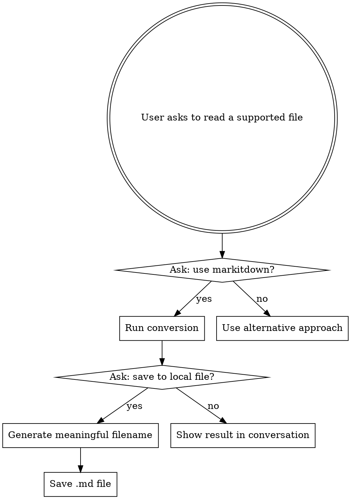

# MarkItDown File Converter

## Overview

Convert document and media files to Markdown using Microsoft's `markitdown` library. **Always ask the user before converting** — the conversion may be lossy or produce large output.

## Supported Formats

| Category | Extensions |
|----------|-----------|
| Documents | `.pdf`, `.docx`, `.pptx`, `.xlsx`, `.xls`, `.epub` |
| Web/Text | `.html`, `.csv`, `.json`, `.xml` |
| Media | `.jpg`, `.jpeg`, `.png` (EXIF/OCR), `.wav`, `.mp3` |
| Archive | `.zip` |
| Other | Outlook `.msg`, YouTube URLs |

## Workflow



## Usage

**IMPORTANT: Always confirm TWO things with the user before/after conversion:**

1. **Before conversion:** "This is a [format] file. Would you like me to use markitdown to convert it to Markdown for reading?"
2. **After conversion:** "Would you like me to save the result as a local .md file, or just show it here?"

### Output Naming

When saving to file, generate a **meaningful filename** based on:
- Document title (from metadata or first heading)
- Content summary (if no clear title)
- Never use generic names like `output.md` or `temp.md`

Examples:
- `2024年度财务报告.md` (from a PDF title)
- `API接口设计文档_v2.md` (from a DOCX heading)
- `Q3销售数据汇总.md` (summarized from an XLSX)

Save location: ask the user where to save, or default to the same directory as the source file.

### Conversion Commands

**Note:** Must run from a directory without a `six.py` file (known conflict in some projects). Use `$env:TEMP` as CWD.

#### Show in conversation (no file saved)

```powershell
Push-Location $env:TEMP; python -c "from markitdown import MarkItDown; md = MarkItDown(); result = md.convert(r'FILEPATH'); print(result.text_content)"; Pop-Location
```

#### Save to local .md file

```powershell
Push-Location $env:TEMP; python -c "from markitdown import MarkItDown; md = MarkItDown(); result = md.convert(r'FILEPATH'); open(r'OUTPUT_PATH', 'w', encoding='utf-8').write(result.text_content)"; Pop-Location
```

For large files, always save to file first then use the Read tool on it.

## When NOT to Use

- Plain text files (`.txt`, `.py`, `.md`) — use Read tool directly
- Files the Read tool already handles well (images for visual inspection, small CSVs)
- When the user just wants file metadata, not content
