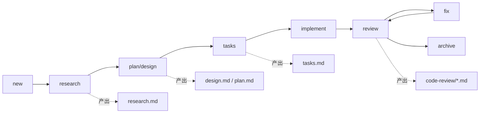

---
aliases:
  - SDD开发流程
  - Spec Driven Development 流程
tags:
  - AI
  - SDD
  - 开发流程
  - 方法论
---

# SDD 开发流程

> [!abstract] 核心结论
> 在复杂项目中，AI Coding 的最优解不是“直接让 AI 写代码”，而是采用 **SDD（Spec-Driven Development）**：
> **先 Research → 再 Design/Plan → 注释迭代达成共识 → 再 Implement → 多轮 Review 收敛 → Archive 沉淀。**

---

## 1. 为什么需要 SDD

> [!info] 问题本质
> AI 最大风险通常不是语法错误，而是 **局部正确、全局错误**。

复杂系统中常见挑战：
- 双引擎/多模块协同，依赖关系复杂。
- 历史包袱重，隐性约束多。
- 文档与代码不同步时，返工成本高。
- 直接编码容易出现“看似可用，实则破坏系统一致性”。

SDD 的核心价值：
- 把思考过程显性化（文档化）
- 把关键决策前置审查
- 把质量控制做成循环闭环

---

## 2. SDD 全流程



> [!tip] 一句话记忆
> **先把“想清楚”写进文档，再让 AI“执行到底”。**

---

## 3. 阶段详解

### 3.1 Research（研究）

> [!check] 目标
> 深度理解现有系统，形成 `research.md` 作为后续设计输入与审查基线。

**必须产物**
- 相关文件清单
- 现有实现路径
- 风险点/冲突点
- 待确认问题列表

**实践要点**
- 明确要求 AI “深入、完整、细节化”阅读。
- `research.md` 必须可审查、可回读、可复用。
- 研究错误会级联污染后续所有阶段（GIGO）。

---

### 3.2 Design / Plan（设计与规划）

> [!check] 目标
> 输出可执行、可审查的 `design.md` / `plan.md`，并与 spec 同步。

**建议包含**
- 变更范围与文件路径
- 关键技术方案与取舍
- 关键代码段（减少语义歧义）
- 兼容性与边界处理

> [!warning] 强约束
> 在设计审查通过前，必须坚持：**don’t implement yet**。

---

### 3.3 Annotation Cycle（注释迭代）

> [!example] 核心动作
> 你在 `plan.md` 直接加注释（纠错/补充/删改），AI 批量处理后回写文档，循环 1~6 轮。

该机制的价值：
- 文档是共享状态，避免聊天上下文漂移。
- 反馈定位精准（在错误位置直接修正）。
- 能批量处理问题，效率高于逐条对话。

---

### 3.4 Tasks（任务拆解）

> [!check] 目标
> 形成细粒度 todo 列表，作为执行与进度追踪依据。

**建议**
- 大任务拆分为子任务（subtask）
- 降低单文档体积，防止上下文膨胀
- 子任务完成后再合并回主提案

---

### 3.5 Implement（实现）

> [!check] 目标
> 按已批准计划执行，减少临场“再设计”。

执行规则：
- 完成一个任务就更新计划状态。
- 持续进行类型/构建检查。
- 避免无意义注释与额外发散。

> [!tip]
> 实现阶段应当“机械化、可验证、低惊喜”。

---

### 3.6 Review ?? Fix（多轮审查收敛）

> [!check] 目标
> 从“能跑”提升到“可靠”，系统性消除中高级问题。

**推荐策略**
- 多轮 AI Code Review（可切换模型独立审查）
- 每轮结论落盘为 md
- 修复后再进下一轮，直到问题收敛
- 关键模块最后补人工 Review

---

### 3.7 Archive（归档）

> [!check] 目标
> 把过程资产化，形成组织可复用知识。

归档内容建议：
- Bug 与根因
- 设计决策与变更原因
- 审查问题与修复映射
- Spec 变更记录

---

## 4. 实战准则（可直接执行）

> [!success] 精华规则
> 1. 先有再优，拒绝一步到位。  
> 2. Write down everything（全部写入 md）。  
> 3. Research 前置，防止全局偏航。  
> 4. Design 放关键代码段，前置审核。  
> 5. 多轮 Review，直到收敛。  
> 6. 用 Subtask 控制文档膨胀。  
> 7. 人在驾驶位：AI 执行，你做取舍。  

---

## 5. 快速检查清单（Checklist）

```markdown
- [ ] research.md 已完成并审阅通过
- [ ] plan/design.md 已完成并审阅通过
- [ ] 注释迭代 >= 1 轮
- [ ] tasks 拆解完成
- [ ] 实现按计划推进并持续校验
- [ ] code review 第 1 轮完成
- [ ] code review 第 2 轮完成
- [ ] code review 第 3 轮完成（如需）
- [ ] 人工关键路径复核完成
- [ ] archive 与 spec 同步完成
```

---

## 6. 结语

> [!quote]
> SDD 不是让 AI 更“自由”，而是给 AI 更“清晰的边界”。
> 通过文档驱动与循环审查，把不确定性前置消解，把质量稳定地做出来。

当这条链路跑顺后，AI Coding 才会从“偶尔有用”变成“稳定产能”。
