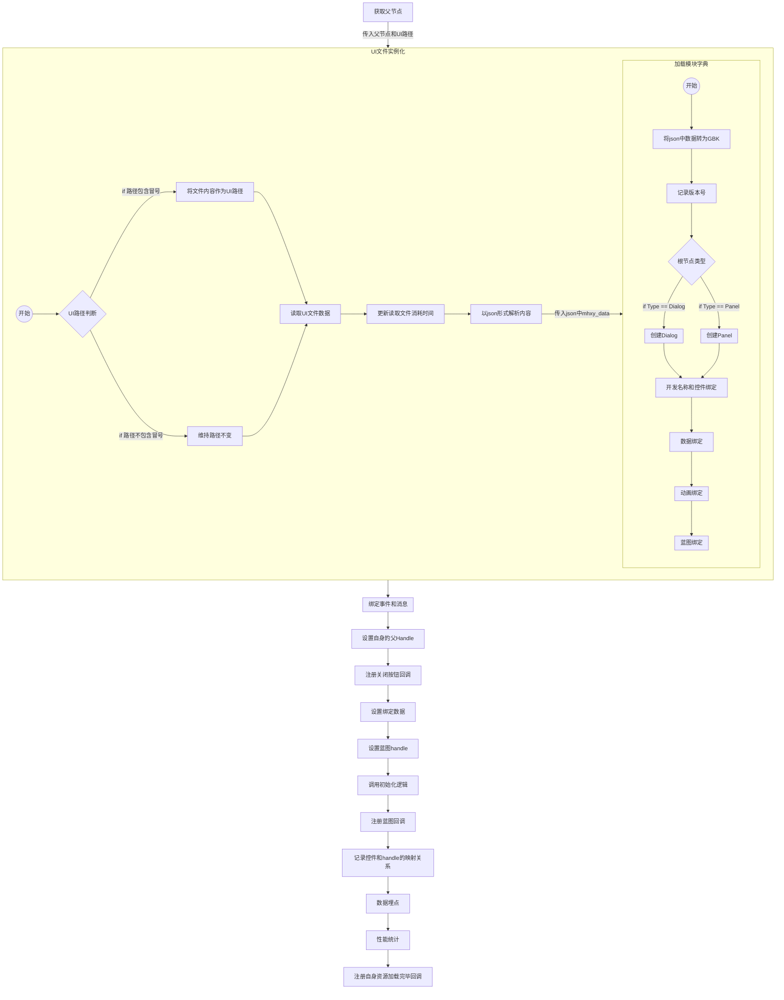

# Handle初始化流程图

```mermaid
flowchart TB
获取父节点 -->|传入父节点和UI路径| UI文件实例化
subgraph UI文件实例化
	id1((开始)) --> id2{UI路径判断}
	id2{UI路径判断} -->|if 路径包含冒号|将文件内容作为UI路径
	id2{UI路径判断} -->|if 路径不包含冒号|维持路径不变
	将文件内容作为UI路径 --> 读取UI文件数据
	维持路径不变 --> 读取UI文件数据
	读取UI文件数据 --> 更新读取文件消耗时间
	更新读取文件消耗时间 --> 以json形式解析内容
	以json形式解析内容 -->|传入json中mhxy_data|加载模块字典
	subgraph 加载模块字典
		id3((开始)) --> 将json中数据转为GBK
		将json中数据转为GBK --> 记录版本号
		记录版本号 --> id4{根节点类型}
		subgraph 创建Dialog
		end
		subgraph 创建Panel
		end
		id4{根节点类型} -->|if Type == Dialog| 创建Dialog
		id4{根节点类型} -->|if Type == Panel| 创建Panel
		创建Dialog --> 开发名称和控件绑定
		创建Panel --> 开发名称和控件绑定
		开发名称和控件绑定 --> 数据绑定
		数据绑定 --> 动画绑定
		subgraph 动画绑定
		end
		动画绑定 --> 蓝图绑定
		subgraph 蓝图绑定
		end
	end
end
UI文件实例化 --> 绑定事件和消息
subgraph 绑定事件和消息
end
绑定事件和消息 --> 设置自身的父Handle
设置自身的父Handle --> 注册关闭按钮回调
注册关闭按钮回调 --> 设置绑定数据
设置绑定数据 --> 设置蓝图handle
设置蓝图handle --> 调用初始化逻辑
调用初始化逻辑 --> 注册蓝图回调
注册蓝图回调 --> 记录控件和handle的映射关系
记录控件和handle的映射关系 --> 数据埋点
数据埋点 --> 性能统计
性能统计 --> 注册自身资源加载完毕回调
```

![[UI创建过程 2024-09-19 09.34.15.excalidraw]]