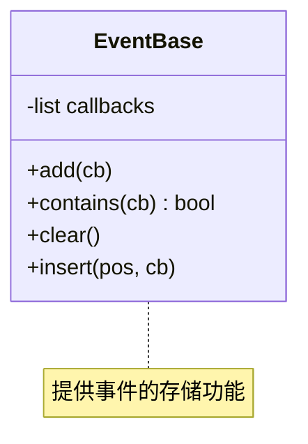

---
tags:
  - reference
---

```mermaid
classDiagram
	direction BT
	
	note for EventBase "提供事件的存储功能"
	class EventBase {
		-list callbacks
		+add(cb)
		+contains(cb) bool
		+clear()
		+insert(pos, cb)
	}

	
```