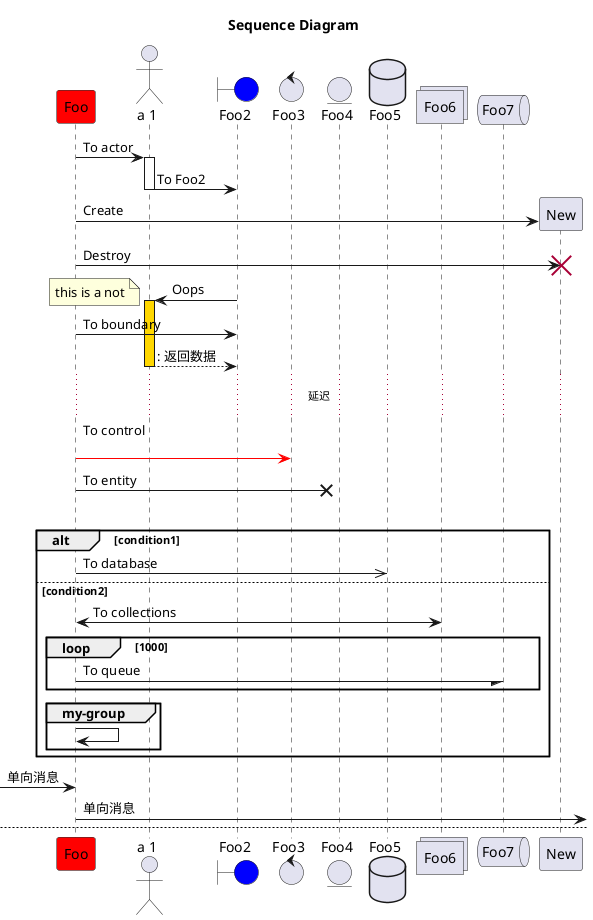

> [!quote]
>描述对象之间发送消息的时间顺序显示多个对象之间的动态协作的UML图。

# 构成元素

- **角色**(Actor)：系统角色，可以是人或者其他系统和子系统，以一个小人图标表示。
- **对象**(Object)：对象位于时序图的顶部，以一个矩形表示。
- **生命线**(LifeLine)：时序图中每个对象和底部中心都有一条垂直的虚线，以一条垂直的虚线表示。
- **控制焦点**(Activation)：控制焦点代表时序图中在对象时间线上某段时期执行的操作，以一个很窄的矩形表示。
- **消息**(Message)：表示对象之间发送的信息，消息分为三种类型：
	- 同步消息(Synchronous Message)消息的发送者把控制传递给消息的接收者，然后停止活动，等待消息的接收者放弃或者返回控制，用来表示同步。以一条实线和实心箭头表示。
	- 异步消息(Asynchronous Message)消息发送者通过消息把信号传递给消息的接收者，然后继续自己的活动，不等待接受者返回消息或者控制。异步消息的接收者和发送者是并发工作的，以一条实线和大于号表示。
	- 返回消息(Return Message)返回消息表示从过程调用返回。以小于号和虚线表示
- **自关联消息**：表示方法的自身调用或者一个对象内的一个方法调用另外一个方法。以一个半闭合的长方形+下方实心箭头表示。

# 类图语法
## PlantUML

> [!hint]
> 官方文档地址：[PlantUML-序列图](https://plantuml.com/zh/sequence-diagram)

语法参考：
