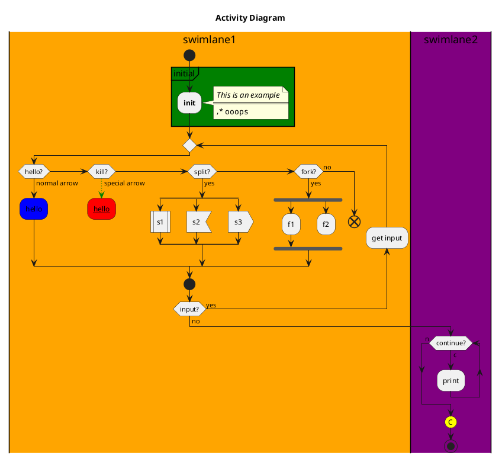

> [!quote]
> 计算机科学中描述系统行为的一种图。状态图要求所描述的系统由有限的状态组成。

# 构成元素

- **活动状态图**(Activity)：活动状态用于表达状态机中的非原子的运行。使用平滑圆角矩形表示。
- **动作状态**(Actions)：动作状态是指原子的，不可中断的动作，并在此动作完成后通过完成转换转向另一个状态。使用平滑圆角矩形表示。
- **动作状态约束**(Action Constraints)：动作状态约束: 用来约束动作状态。使用折页矩形表示。
- **动作流**(Control Flow)：动作之间的转换称之为动作流活动图的转换。使用带箭头直线表示。
- **开始节点**(Initial Node)：活动开始节点。使用实心黑色圆点表示。
- **终止节点**(Final Node)：
	- 活动终止节点(activity final nodes)：活动终止节点表示整个活动的结束。使用圆圈+内部实心黑色圆点表示。
	- 流程终止节点(flow final nodes)：流程终止节点表示是子流程的结束。使用圆圈+内部十字叉。
- **对象**(Objects)：使用矩形方框表示。
- **数据存储对象**(DataStore)：使用关键字`<<datastore>>`。使用矩形方框表示，内含关键字。
- **对象流**(Object Flows)：对象流是动作状态或者活动状态与对象之间的依赖关系，表示动作使用对象或动作对对象的影响。
- **分支与合并**(Decision and Merge Nodes)：选择分支。使用棱形表示。
- **分叉与汇合**(Fork and Join Nodes)：分叉用于将动作流分为两个或多个并发运行的分支，而汇合则用于同步这些并发分支，以达到共同完成一项事务的目的，使用加粗黑线表示。
- **泳道**(Partition)：泳道将活动图中的活动划分为若干组，并把每一组指定给负责这组活动的业务组织，即对象。使用垂直直线分隔表示。

# 状态图语法

许多软件提供编程语言来绘制类图，下面介绍两种可以用来绘制类图的编程语言。
## Mermaid

> [!hint]
> 官方文档地址：[Mermaid-状态图](https://mermaid.nodejs.cn/syntax/stateDiagram.html)

## PlantUML

> [!hint]
> 官方文档地址：[PlantUML-活动图](https://plantuml.com/zh/activity-diagram-legacy)

语法参考：
