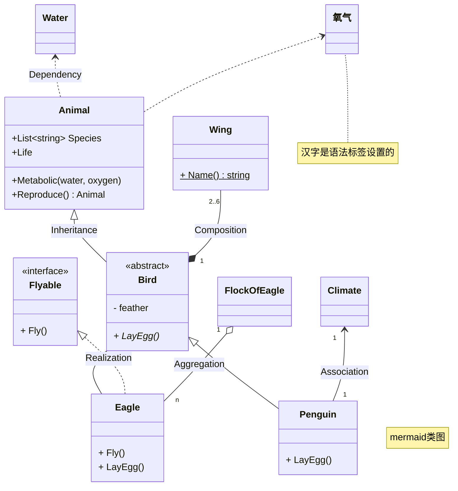
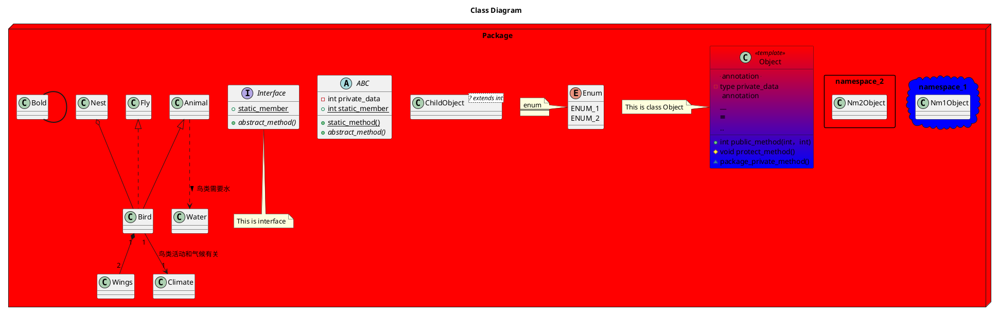

> [!quote]
> 用来描述系统静态结构，表示类与类之间的关系。我们利用其来说明系统的角色和责任。其中最基本的两个元素是**类**和它们的**基本关系**。

# 构成元素

类由名称，属性和方法构成：

- 类的**名字**：类功能的概括，形式为：`name`
- 类的**属性**：类里的字段，形式为：`+|-|# name: type [= default_value]`
- 类的**方法**：类提供方法，形式为：`+|-|# name(args list) [: return_type]`

> [!note] 访问级别
> - +：公开
> - -：私有
> - \#：保护
> - ~：内部

类之间的关系有以下几个(由强到弱)：

- 泛化(Generalization)：指继承关系，实线空心三角箭头，由子类指向父类。
- 实现(Realization)：指接口继承，子类必须实现父类接口，虚线空心三角箭头，由子类指向父类。
- 组合(Composition)：表明部分是整体的一部分，且部分无法脱离整体单独存在，实心棱形三角箭头，棱形指向整体。
- 聚合(Aggregation)：表明部分是整体的一部分，部分可以脱离整体存在，空心棱形三角箭头，棱形指向整体。
- 关联(Association)：指两个类之间有了解，单向实线箭头指向被了解者，双向用实线表示。
- 依赖(Dependency)：使用关系，虚线三角箭头，指向被使用者。

# 效果演示

![[类图 2023-11-02 17.47.18.excalidraw]]

# 类图语法

许多软件提供编程语言来绘制类图，下面介绍两种可以用来绘制类图的编程语言。
## Mermaid

> [!hint]
> 官方文档地址：[Mermaid-类图](https://mermaid.nodejs.cn/syntax/classDiagram.html)

实现效果图所需代码：

## PlantUML

> [!hint]
> 官方文档地址：[PlantUML-类图](https://plantuml.com/zh/class-diagram)

语法参考：

