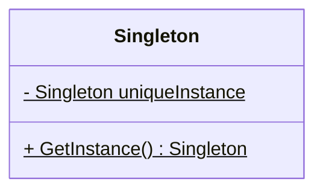

---
tags:
  - reference
design_pattern: Singleton
category: 创建型模式
---
> [!summary] 意图
> 保证一个类仅有一个实例，并且提供一个访问它的全局访问点。

> [!summary] 适用性
> 在以下情况下可以使用：
> - 当一个类只能有一个实例而且客户可以从一个众所周知的访问点访问的时候。
> - 当这个唯一实例可以通过子类化扩展，并且客户无需更改代码就能使用实例的时候。

> [!summary] 结构图

> [!summary] 效果
> 1. 提供对唯一实例的受控访问。
> 2. 缩小命名空间。是对全局变量的一种改进

> [!tips] 实现细节
> - 保证一个唯一的实例

> [!note] 相关模式
