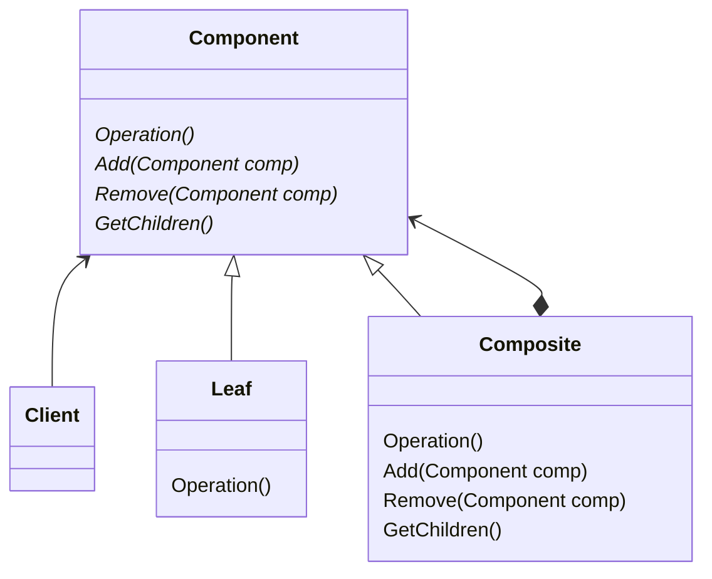

---
tags:
  - reference
design_pattern: Composite
category: 结构型模式
---
> [!summary] 意图
> 将对象组合成树形状结构以表示 ”**部分-整体**“ 的层次结构，组合模式使得用户对单个对象和组合对象的使用具有一致性。

> [!summary] 适用性
> 在以下情况下可以使用：
> - 你想表示对象的**部分-整体**层次结构。
> - 你希望用户忽略组合对象与单个对象的不同，用户将统一使用组合结构中的所有对象。

> [!summary] 结构图
> ![[组合模式 2023-11-17 20.22.14.excalidraw]]
> 用户使用`Component`类接口于组合结构中的对象交互。如果接收者是一个叶节点则直接处理，否则的话将请求发送给它的子节点。

> [!summary] 效果
> 1. 定义了包含基本对象和组合对象的类层次。
> 2. 简化客户的调用代码。
> 3. 使得更容易增加新类型的组件。
> 4. 使得你的设计更加一般化。

> [!tips] 实现细节
> - 持有父节点的引用可以简化遍历的管理流程。
> - 子部件是否需要进行排序。
> - 应该由谁来删除子部件。
> - 最大化叶子部件和组合部件相同的接口，放到基类中。
> - 使用什么样的数据结构存储子部件更加合理。

> [!note] 相关模式
> - [[责任链模式]]会使用本模式。
> - 经常同[[装饰模式]]一起使用。
> - [[读书笔记/设计模式/享元模式|享元模式]]可以让你共享组件。
> - [[迭代器模式]]可以用来遍历树状结构。
> - [[访问者模式]]将本来分布在类中的行为局部化。
